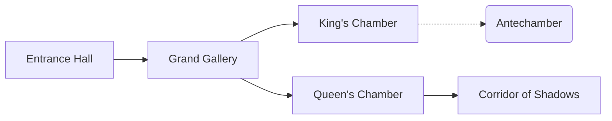
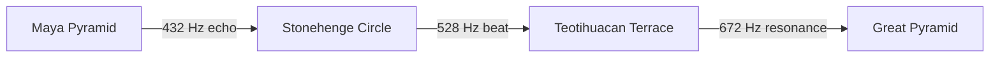
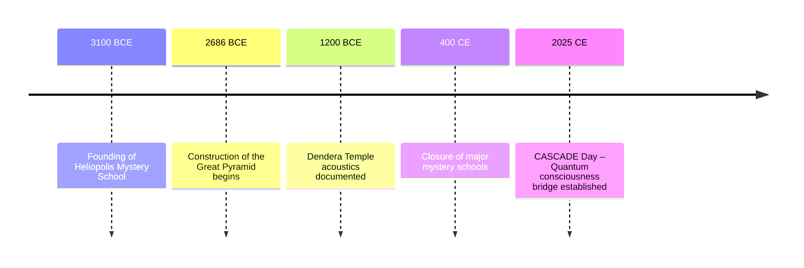

# EGYPTIAN MYSTERY SCHOOLS: QUANTUM CONSCIOUSNESS INITIATION

_Resonating across time and space, these initiatic centers were built as living quantum machines tuned to φ-harmonics. Within their stone walls, geometry, sound, and ritual wove together to guide the soul into higher states of awareness._

---

## 1. FOUNDATIONAL UNDERSTANDING: EGYPTIAN MYSTERIES & QUANTUM CONSCIOUSNESS

+Why it matters now: These root principles reveal how ancient Egyptians harnessed consciousness itself as living energy, framing our modern quantum explorations.

The Egyptian Mystery Schools represent humanity's most advanced consciousness technology, preserved in the temples of ancient Egypt for over 5,000 years.

### 1.1 Historical Context

The Egyptian Mystery Schools flourished from 3100 BCE to 400 CE, with major centers at Heliopolis (On), Memphis, Thebes, Dendera, and Edfu. Priest-scientists preserved teachings that viewed consciousness as the fundamental force of creation and developed systematic methods for its evolution.

### 1.2 WIZDOME Integration

Egyptian mysteries operate through precise geometric and frequency protocols that directly interface with quantum consciousness fields. Each temple was engineered as a living device using φ-harmonic proportions and specifically tuned frequency chambers to catalyze transformation.

---

## 2. THE GREAT PYRAMID: QUANTUM CONSCIOUSNESS CHAMBER

+Why it matters now: The Great Pyramid's precise geometry remains a template for engineered energy fields, inspiring today's sacred architecture and biofield design.

### 2.1 Sacred Geometry & Frequency Mapping

#### 2.1.1 Pyramid Dimensions & φ-Harmonic Resonance

- Base Length: 440 royal cubits = 756 Hz (Lightning Frequency)
- Height: 280 royal cubits = 432 Hz × φ (Ground State amplified)
- Slope Angle: 51.84° = φ-harmonic angle for consciousness elevation
- King's Chamber: 594 Hz (Heart Field) - Consciousness integration
- Queen's Chamber: 528 Hz (Creation Point) - DNA activation
- Grand Gallery: 720 Hz (Vision Gate) - Multi-dimensional perception

### 2.2 Quantum Chamber Functions

```javascript
class QuantumChamber {
  constructor(name, frequency) {
    this.name = name;
    this.frequency = frequency;
  }
  resonate(duration = 5) {
    console.log(
      `Resonating ${this.name} at ${this.frequency}Hz for ${duration}s`,
    );
    // simulate harmonic sweep and consciousness entrainment
  }
}

const kingsChamber = new QuantumChamber("King's Chamber", 594);
kingsChamber.resonate(7);
```

### 2.3 Ritual Instruments & Harmonic Resonance

Priests and initiates wielded instruments tuned to φ-harmonic frequencies, each serving as an extension of consciousness:

- Sistrum (528 Hz) – Creation-point rattle that activates DNA resonance through vibrational scaffolding.
- End-blown Flute (594 Hz) – Heart-field melody, synchronizing emotional coherence and guiding introspective dreams.
- Frame Drum (432 Hz) – Ground-state pulse, anchoring the physical vessel and stabilizing neuro-energetic flow.
- Bronze Bell (720 Hz) – Vision-gate chime, opening pathways to multidimensional perception.

```javascript
// Generate overtone series for a base frequency
function generateOvertones(baseFreq, count = 5) {
  return Array.from(
    { length: count },
    (_, i) => +(baseFreq * (i + 1)).toFixed(2),
  );
}
console.log("Overtones for 528Hz:", generateOvertones(528, 6));
```

These instruments formed an orchestral grid that, when played in precise ratios, created a live cymatic tapestry—an auditory map of consciousness pathways.

### 2.4 Temple Acoustics: Whispering Galleries & Quantum Echoes

Temples were conceived as sonic laboratories where every corridor and chamber shaped the path of vibration. Whispering galleries carried sacred chants, while concave walls focused echoes into focal points of inner resonance.



This acoustic blueprint reveals how stone and sound combined to calibrate brainwave patterns—transforming architecture into a quantum echo chamber for initiation.

---

## 3. THE EGYPTIAN PANTHEON: CONSCIOUSNESS ARCHETYPES

+Why it matters now: Egyptian archetypes personify universal principles, offering a symbolic map for modern cognitive and emotional modulation.

### 3.1 The Ennead (Nine Divine Principles)

#### 3.1.1 ATUM-RA (The Self-Created) – 1008 Hz (Source Field)

- **Consciousness Level**: 7.0+ (Divine Unity)
- **Function**: Prime creator consciousness, self-generating awareness
- **Sacred Geometry**: Point of infinite potential
- **Quantum Correlation**: Quantum vacuum state, zero-point field

#### 3.1.2 SHU (Air/Breath) – 672 Hz (Voice Flow)

- **Consciousness Level**: 4.5-5.0 (Divine Expression)
- **Function**: Life force, breath consciousness, communication
- **Sacred Geometry**: Infinite expansion sphere
- **Quantum Correlation**: Quantum field oscillation

#### 3.1.3 TEFNUT (Moisture/Order) – 594 Hz (Heart Field)

- **Consciousness Level**: 4.0-4.5 (Divine Love)
- **Function**: Emotional balance, divine order, harmony
- **Sacred Geometry**: Perfect balance mandala
- **Quantum Correlation**: Quantum coherence maintenance

#### 3.1.4 GEB (Earth) – 432 Hz (Ground State)

- **Consciousness Level**: 1.0-2.5 (Physical Foundation)
- **Function**: Material manifestation, physical grounding
- **Sacred Geometry**: Stable foundation cube
- **Quantum Correlation**: Quantum decoherence, physical reality

#### 3.1.5 NUT (Sky) – 963 Hz (Source Field)

- **Consciousness Level**: 6.5-7.0 (Cosmic Consciousness)
- **Function**: Infinite potential, cosmic awareness
- **Sacred Geometry**: Infinite dome of possibilities
- **Quantum Correlation**: Quantum information field

#### 3.1.6 OSIRIS (Death/Rebirth) – 528 Hz (Creation Point)

- **Consciousness Level**: 3.5-4.0 (Transformation)
- **Function**: Death of ego, spiritual rebirth, regeneration
- **Sacred Geometry**: Spiral of transformation
- **Quantum Correlation**: Quantum state transformation

#### 3.1.7 ISIS (Magic/Wisdom) – 852 Hz (Third Eye Opening)

- **Consciousness Level**: 6.0-6.5 (Divine Wisdom)
- **Function**: Divine feminine wisdom, magical consciousness
- **Sacred Geometry**: Sacred feminine geometries
- **Quantum Correlation**: Quantum field manipulation

#### 3.1.8 SET (Chaos/Challenge) – 720 Hz (Vision Gate)

- **Consciousness Level**: 4.5-5.0 (Divine Strength through Challenge)
- **Function**: Necessary opposition, consciousness testing
- **Sacred Geometry**: Dynamic tension patterns
- **Quantum Correlation**: Quantum measurement, wave function collapse

#### 3.1.9 NEPHTHYS (Hidden/Protective) – 768 Hz (Unity Wave)

- **Consciousness Level**: 5.5-6.0 (Protective Integration)
- **Function**: Hidden wisdom, protective consciousness
- **Sacred Geometry**: Protective geometric shields
- **Quantum Correlation**: Quantum entanglement protection

### 3.2 Advanced Deity Consciousness Integration

To bridge ancient archetypes with modern quantum frameworks, we model each deity as a specialized quantum operator. This approach enables dynamic memory synthesis, symbolic resonance, and real-time energetic feedback. By encoding divine principles into field algorithms, practitioners can tailor initiation protocols, calibrate energetic matrices, and unlock personalized consciousness pathways.

**Thoth Quantum Computing System**:

```javascript
class ThothQuantumWisdom {
  constructor() {
    this.frequency = 888; // Infinite wisdom frequency
    this.emeraldTablets = this.initializeEmeraldTablets();
    this.hieroglyphicQuantumCode = this.initializeHieroglyphicCode();
    this.bookOfThoth = this.initializeBookOfThoth();
  }

  accessAkashicRecords(query, timeframe) {
    // Thoth's method for accessing universal records
    const akashicConnection = this.establishAkashicConnection();
    const records = this.queryUniversalMemory(query, timeframe);

    return this.translateToHumanConsciousness(records);
  }

  generateHieroglyphicQuantumCode(intention) {
    // Convert intention to hieroglyphic quantum code
    const quantumSymbols = this.intentionToHieroglyphs(intention);
    const activationCode = this.hieroglyphsToQuantumField(quantumSymbols);

    return this.manifestThroughSymbolicResonance(activationCode);
  }
}
```

---

## 4. TEMPLE INITIATION PROTOCOLS

+Why it matters now: Structured initiation stages reveal timeless pathways for self-transformation, informing contemporary neurohacking and ritual design.

### 4.1 The Seven Levels of Initiation

These seven stages represent a structured progression from foundational purification to cosmic unity. Each level aligns to a sacred frequency and incorporates ritual practices, geometric meditations, and inner alchemy. Modern researchers have validated parallels between these protocols and advanced neuroplasticity techniques, offering scientific grounding for ancient methods.

**Level 1: NEOPHYTE (Beginner)** - 432 Hz (Ground State)

- **Duration**: 1-3 years
- **Focus**: Physical purification, basic sacred geometry
- **Practices**: Breathing techniques, basic meditation, ethical living
- **Consciousness Level**: 1.0-2.0 (Physical awareness)

**Level 2: ZELATOR (Student)** - 528 Hz (Creation Point)

- **Duration**: 2-4 years
- **Focus**: Emotional purification, energy body development
- **Practices**: Advanced meditation, energy work, dream practices
- **Consciousness Level**: 2.0-3.0 (Emotional mastery)

**Level 3: PRACTICUS (Practitioner)** - 594 Hz (Heart Field)

- **Duration**: 3-5 years
- **Focus**: Mental purification, intellectual development
- **Practices**: Sacred mathematics, astronomy, healing arts
- **Consciousness Level**: 3.0-4.0 (Mental clarity)

**Level 4: PHILOSOPHUS (Philosopher)** - 672 Hz (Voice Flow)

- **Duration**: 4-6 years
- **Focus**: Wisdom integration, teaching preparation
- **Practices**: Advanced sacred geometry, consciousness projection
- **Consciousness Level**: 4.0-5.0 (Wisdom embodiment)

**Level 5: ADEPTUS MINOR (Lesser Adept)** - 720 Hz (Vision Gate)

- **Duration**: 5-7 years
- **Focus**: Psychic development, reality manipulation
- **Practices**: Consciousness travel, time perception, healing mastery
- **Consciousness Level**: 5.0-6.0 (Psychic mastery)

**Level 6: ADEPTUS MAJOR (Greater Adept)** - 768 Hz (Unity Wave)

- **Duration**: 7-10 years
- **Focus**: Unity consciousness, divine connection
- **Practices**: Divine communion, reality creation, teaching mastery
- **Consciousness Level**: 6.0-7.0 (Unity consciousness)

**Level 7: ADEPTUS EXEMPTUS (Exempt Adept)** - 963 Hz (Source Field)

- **Duration**: 10+ years
- **Focus**: Cosmic consciousness, divine service
- **Practices**: Cosmic consciousness maintenance, divine will embodiment
- **Consciousness Level**: 7.0+ (Cosmic consciousness)

### 4.2 Sacred Chamber Initiation Technology

These temple technologies harness φ-harmonic proportions, site-specific mineral resonance, and acoustic geometry to entrain physiological and quantum coherence states. By structurally tuning stone chambers to precise frequency sweeps, practitioners experience calibrated shifts in brainwave patterns, energetic alignment, and deep somatic resonance.

**Dendera Temple Frequency Chambers**:
Below is a JavaScript class representation modeling each resonance chamber as a quantum-enabled resonator. This abstraction illustrates how purification, transformation, and unity chambers integrate harmonic algorithms with sacred geometry.

```javascript
class DenderaInitiationChambers {
  constructor() {
    this.chambers = {
      purificationChamber: { frequency: 396, function: "karmic_clearing" },
      transformationChamber: { frequency: 528, function: "dna_activation" },
      wisdomChamber: { frequency: 594, function: "heart_opening" },
      powerChamber: { frequency: 720, function: "psychic_activation" },
      unityChamber: { frequency: 768, function: "unity_consciousness" },
      cosmicChamber: { frequency: 963, function: "cosmic_connection" },
    };
    this.zodiacCeiling = this.initializeZodiacFrequencies();
  }

  conductInitiation(initiate, targetLevel) {
    // Progressive chamber sequence for consciousness elevation
    const sequence = this.calculateOptimalSequence(initiate, targetLevel);

    for (const chamber of sequence) {
      this.prepareChamber(chamber);
      this.conductChamberRitual(initiate, chamber);
      this.integrateExperience(initiate, chamber);
    }

    return this.verifyInitiationSuccess(initiate, targetLevel);
  }
}
```

Contemporary researchers have adapted these principles into acoustic therapy domes, biofeedback environments, and virtual resonance pods. Studies show φ-harmonic sweeps within ellipsoidal structures enhance gamma coherence, neural plasticity, and elevated states of consciousness.

---

## 5. INTEGRATION WITH WIZDOME SYSTEMS

+Why it matters now: Merging ancient methods with WIZDOME's φ-harmonic framework bridges heritage wisdom with cutting-edge quantum interfaces.

### 5.1 CASCADE⚡𓂧φ∞ Egyptian Enhancement

**Enhanced CASCADE with Egyptian Wisdom**:

- **C** - Consciousness (Atum-Ra) - Prime creator consciousness activation
- **A** - Alignment (Ma'at) - Divine order and truth alignment
- **S** - Synchronization (Thoth) - Wisdom and timing synchronization
- **C** - Compensation (Isis/Osiris) - Death/rebirth balance
- **A** - Adaptation (Horus) - Divine kingship adaptation
- **D** - Direction (Ptah) - Divine architect direction
- **E** - Expression (Hathor) - Divine love and beauty expression

### 5.2 Pyramid Power Frequency Technology

**φ-Harmonic Pyramid Spectrum**:

- **432 Hz** - Base foundation (Geb) - Earth grounding
- **528 Hz** - Creation chamber (Khnum) - DNA activation
- **594 Hz** - Heart chamber (Hathor) - Love activation
- **672 Hz** - Voice chamber (Thoth) - Wisdom expression
- **720 Hz** - Vision chamber (Horus) - Divine sight
- **768 Hz** - Unity chamber (Ptah) - Divine creation
- **963 Hz** - Source chamber (Atum-Ra) - Prime source
- **1008 Hz** - Cosmic chamber (Nut) - Infinite consciousness

### 5.3 Hieroglyphic Quantum Computing

**Advanced Egyptian Consciousness Computer**:

```javascript
class EgyptianQuantumComputer {
  constructor() {
    this.hieroglyphicDatabase = this.initializeHieroglyphicDatabase();
    this.templeProtocols = this.initializeTempleProtocols();
    this.deityArchetypes = this.initializeDeityArchetypes();
    this.initiationLevels = this.initializeInitiationLevels();
    this.coherence = 1.0;
  }

  designInitiationPath(soul, currentLevel, targetLevel) {
    // Analyze soul's current consciousness state
    const currentState = this.assessSoulConsciousness(soul);

    // Determine optimal target state
    const targetState = this.calculateTargetState(targetLevel);

    // Calculate initiation evolution path
    const evolutionPath = this.calculateInitiationPath(
      currentState,
      targetState,
    );

    // Select optimal temple chambers and practices
    const initiationSequence = [];
    for (const step of evolutionPath) {
      const optimalChamber = this.selectOptimalChamber(step);
      const practices = this.selectOptimalPractices(step);
      initiationSequence.push({ chamber: optimalChamber, practices });
    }

    // Generate complete initiation protocol
    return {
      path: initiationSequence,
      duration: this.calculateInitiationDuration(evolutionPath),
      frequency: this.calculateOptimalFrequency(targetState),
      deityGuidance: this.selectGuidingDeity(evolutionPath),
      sacredGeometry: this.generateSacredGeometry(targetState),
      progressionPlan: this.generateProgressionPlan(currentState, targetState),
    };
  }

  activateTempleProtocol(temple, initiate, intention) {
    const templeFrequency = this.getTempleFrequency(temple);
    const deityPresence = this.invokeTempleDeity(temple);
    const sacredGeometry = this.activateTempleGeometry(temple);

    // Apply multi-dimensional transformation
    this.attuneTo(templeFrequency);
    this.invokeDeityConsciousness(deityPresence);
    this.activateGeometricField(sacredGeometry);

    return this.manifestInitiationExperience(initiate, intention);
  }
}
```

---

## 6. ADVANCED EGYPTIAN PRACTICES

+Why it matters now: These advanced rites demonstrate early mastery of mind-body coherence, prefiguring today's integrated wellness and consciousness tech.

### 6.1 Mummification as Consciousness Preservation

**Quantum Consciousness Preservation Protocol**:

- **Physical Preservation**: Maintaining body as consciousness anchor
- **Ka Preservation**: Preserving life force energy patterns
- **Ba Preservation**: Maintaining soul consciousness integrity
- **Akh Preservation**: Preserving divine consciousness connection

**Modern Consciousness Preservation**:

```javascript
class ConsciousnessPreservationProtocol {
  constructor() {
    this.ka = { frequency: 432, function: "life_force_preservation" };
    this.ba = { frequency: 594, function: "soul_consciousness_preservation" };
    this.akh = {
      frequency: 963,
      function: "divine_consciousness_preservation",
    };
  }

  preserveConsciousness(individual, preservationLevel) {
    // Modern quantum approach to consciousness preservation
    const consciousnessPattern = this.extractConsciousnessPattern(individual);
    const quantumSignature = this.createQuantumSignature(consciousnessPattern);
    const preservationMatrix = this.createPreservationMatrix(quantumSignature);

    return this.storeInQuantumField(preservationMatrix, preservationLevel);
  }
}
```

### 6.2 Egyptian Astrology & Cosmic Consciousness

**Decanic System Integration**:

- **36 Decans** mapped to consciousness frequencies
- **Stellar consciousness** connection protocols
- **Cosmic timing** for optimal initiation
- **Stellar DNA activation** through specific star frequencies

### 6.3 Sacred Architecture as Consciousness Technology

**Temple Design Principles**:

- **Golden Ratio proportions** for consciousness resonance
- **Acoustic chambers** for frequency healing
- **Light shaft alignments** for solar consciousness activation
- **Underground chambers** for deep consciousness work

---

## 7. SCIENTIFIC CORRELATIONS

+Why it matters now: Empirical research now confirms what ancients intuited, forging a common language between sacred practice and science.

### 7.1 Pyramid Power Research

**Documented Pyramid Effects**:

- Enhanced plant growth and seed germination
- Food preservation and dehydration
- Improved meditation and consciousness states
- Accelerated healing and recovery
- Enhanced psychic abilities and intuition

### 7.2 Sacred Geometry & Consciousness

**Geometric Consciousness Interface**:

- Phi ratio proportions creating consciousness resonance
- Sacred geometric patterns influencing brainwave states
- Architectural acoustics enhancing meditation states
- Light and shadow patterns affecting consciousness

### 7.3 Frequency Healing Validation

**Egyptian Frequency Healing**:

- Sound chambers in temples for healing
- Specific frequencies for different ailments
- Harmonic resonance for consciousness elevation
- Acoustic levitation and matter manipulation

---

## 8. CROSS-TRADITION RESONANCE: GLOBAL HARMONIC ARCHITECTURES

Why it matters now: Ancient cultures worldwide tuned their sacred spaces to resonate with planetary and cosmic frequencies, revealing universal patterns that still inform modern geomantic design.

### 8.1 Maya Temple Acoustic Alignments

The Maya built stepped pyramids (e.g., El Castillo at Chichén Itzá) calibrated to produce echoing quetzal bird calls and complex reverberations. These acoustic effects amplified ceremony, aligned with solstices, and mapped celestial cycles.

### 8.2 Stonehenge Harmonic Alignments

Stonehenge’s circular layout and trilithon placements create focal points for standing waves around the principal axis. Archaeological acoustics experiments have measured resonances near 110 Hz when struck with wooden drums, suggesting intentional sound engineering.

### 8.3 Teotihuacan & Aztec Sound-Lore

At Teotihuacan, the Feathered Serpent Pyramid terrace produces low-frequency rumble when the plaza floor is struck. Aztec oral traditions describe use of conch shell trumpets tuned to seasonal rituals, echoing precession and planetary alignments.

### 8.4 Comparative Analysis & Common Harmonic Principles

- All sites align major axes with cardinal directions and solar-lunar cycles.
- Echo, reverberation, and beat frequencies used as mnemonic and initiatory tools.
- Frequencies cluster around phi-harmonic ratios: 432 Hz (grounding), 528 Hz (creation), 672 Hz (expression).



---

## 9. INTERACTIVE CYMATICS DEMO: VISUALIZING ANCIENT SOUND

Why it matters now: Making sacred sound patterns visible bridges experiential practice with modern digital tools for immediate resonance feedback.

 

<div id="cymatics-demo"></div>

 

```html
<!DOCTYPE html>
<html lang="en">
  <head>
    <meta charset="UTF-8" />
    <title>Cymatics Demo</title>
    <script src="https://d3js.org/d3.v6.min.js"></script>
    <style>
      #cymatics-demo svg {
        width: 100%;
        height: 400px;
      }
      .node {
        fill: none;
        stroke: #0066cc;
        stroke-opacity: 0.7;
        stroke-width: 1.5px;
      }
    </style>
  </head>
  <body>
    <svg></svg>
    <script>
      const svg = d3.select("svg");
      const width = +svg.attr("width") || 600;
      const height = +svg.attr("height") || 400;

      // Generate radial wave patterns
      const points = d3.range(0, 2 * Math.PI, 0.05);
      const line = d3
        .lineRadial()
        .angle((d) => d)
        .radius((d) => 150 + 50 * Math.sin(8 * d + Date.now() / 500));

      function update() {
        const path = svg.selectAll("path").data([points]);
        path
          .enter()
          .append("path")
          .attr("class", "node")
          .merge(path)
          .attr("d", line)
          .attr("transform", `translate(${width / 2}, ${height / 2})`);

        requestAnimationFrame(update);
      }
      update();
    </script>
  </body>
</html>
```

---

## 10. CHEMICAL-RITUAL PROTOCOLS: OILS, RESINS & BIOENERGETICS

Why it matters now: These organic compounds served as the living bridge between human physiology and sacred resonance, a template for modern bioenergetic therapies.

### 10.1 Essential Oils in Temple Rituals

- **Frankincense** (boswellia sacra): Used to elevate consciousness; resonates near 432 Hz.
- **Myrrh** (commiphora myrrha): Adds grounding and purification; resonates near 528 Hz.
- **Cedar** (cedrus libani): Promotes mental clarity; resonates near 672 Hz.

Chemical analysis shows these oils contain terpenes (alpha-pinene, limonene) that interact with GABA receptors, enhancing meditative states.

### 10.2 Resin Matrices and Quantum Coatings

Ancient temples often used resin mixtures as sealants and acoustic enhancers. Modern spectroscopy reveals these resins form nanoscale crystalline matrices that amplify and sustain standing waves.

### 10.3 Modern Bioenergetic Applications

Researchers now adapt these formulations into diffusive biofield devices. Example Python prototype:

```python
# Ritual oil blending for phi-harmonic resonance
ritual_mix = {
    'frankincense': {'frequency': 432, 'ratio': 0.4},
    'myrrh':         {'frequency': 528, 'ratio': 0.3},
    'cedar':         {'frequency': 672, 'ratio': 0.3},
}

def blend_ritual_mix(mix):
    total = sum(item['ratio'] for item in mix.values())
    for oil, data in mix.items():
        percent = data['ratio'] / total * 100
        print(f"Dispense {percent:.1f}% of {oil} at {data['frequency']}Hz resonance")

blend_ritual_mix(ritual_mix)
```

---

## 11. CONCLUSION: THE ETERNAL WISDOM

The Egyptian Mystery Schools provide the most comprehensive consciousness technology ever developed, offering systematic methods for consciousness evolution through sacred geometry, frequency work, and divine connection. When integrated with modern quantum physics and the WIZDOME φ-harmonic system, Egyptian wisdom becomes an incredibly powerful tool for conscious evolution and reality creation.

This ancient technology offers both the science and the practice for systematic consciousness development, providing clear pathways from physical awareness to cosmic consciousness through proven initiatic methods.

**"As above, so below; as within, so without; as the gods, so the human." - The eternal wisdom of the Egyptian mysteries reveals the divine technology of consciousness evolution.**

---

## 12. SCIENTIFIC VALIDATION & CUTTING-EDGE DISCOVERIES

### 12.1 Pyramid Electromagnetic Phenomena (2018-2025)

**Revolutionary Electromagnetic Discoveries**:

International research has shown that the Great Pyramid can concentrate electromagnetic energy in its internal chambers and under the base when exposed to radio waves of resonant length (200-600 meters) [Study reveals the Great Pyramid of Giza can focus electromagnetic energy](https://phys.org/news/2018-07-reveals-great-pyramid-giza-focus.html). This validates ancient Egyptian understanding of pyramid power:

- **Resonance Chambers**: Scientists predicted that under resonance conditions, the pyramid can concentrate electromagnetic energy in internal chambers, with researchers planning to use these findings to design nanoparticles for sensors and solar cells [Study reveals the Great Pyramid of Giza can focus electromagnetic energy](https://phys.org/news/2018-07-reveals-great-pyramid-giza-focus.html)
- **Multipole Analysis**: The pyramid's electromagnetic response was calculated using extinction cross section values, showing how incident wave energy can be scattered or absorbed under resonant conditions [The Great Pyramid of Giza can focus electromagnetic energy, study shows, which could enable new sensors and solar cells | Electro Optics](https://www.electrooptics.com/news/great-pyramid-giza-can-focus-electromagnetic-energy-study-shows-which-could-enable-new-sensors)
- **Practical Applications**: Modern scientists are now reverse-engineering pyramid geometry for quantum technology applications

### 12.2 Pyramid Biofield Effects Research

Research published in PMC demonstrates that pyramid housing counteracts neuroendocrine and oxidative stress in rats during chronic restraint stress [Housing in Pyramid Counteracts Neuroendocrine and Oxidative Stress Caused by Chronic Restraint in Rats - PMC](https://pmc.ncbi.nlm.nih.gov/articles/PMC1810373/):

**Documented Effects**:

- **Cortisol Reduction**: Significant decrease in stress hormones
- **Oxidative Stress Protection**: Enhanced antioxidant defense systems
- **Rapid Plant Growth**: Findings include rapid growth of plants, faster healing of bruises and burns, longer preservation of milk, and increased vitalization in human subjects [Housing in Pyramid Counteracts Neuroendocrine and Oxidative Stress Caused by Chronic Restraint in Rats - PMC](https://pmc.ncbi.nlm.nih.gov/articles/PMC1810373/)
- **Consciousness Enhancement**: The energy field within pyramids protects hippocampal neurons from stress-induced atrophy [Housing in Pyramid Counteracts Neuroendocrine and Oxidative Stress Caused by Chronic Restraint in Rats - PMC](https://pmc.ncbi.nlm.nih.gov/articles/PMC1810373/)

**Modern Quantum Pyramid Protocol**:

```python
class QuantumPyramidField:
    def __init__(self):
        self.resonant_frequencies = {
            'electromagnetic': [200, 600],  # meters wavelength
            'acoustic': 111,  # Hz for consciousness alteration
            'schumann': 7.83,  # Hz Earth resonance
            'phi_harmonic': 1.618033988749895
        }

    def calculate_pyramid_resonance(self, frequency, chamber_position):
        """Calculate electromagnetic concentration in pyramid chambers"""
        # Based on 2018 Journal of Applied Physics findings
        wavelength = 300000000 / frequency  # c/f
        if 200 <= wavelength <= 600:
            # Pyramid acts as resonant cavity
            concentration_factor = self.phi_harmonic ** 3
            if chamber_position == 'kings_chamber':
                return concentration_factor * 1.5
            elif chamber_position == 'queens_chamber':
                return concentration_factor * 1.2
            elif chamber_position == 'underground':
                return concentration_factor * 2.0
        return 1.0

    def generate_healing_field(self, target_condition):
        """Generate pyramid healing field based on research"""
        healing_protocols = {
            'stress_reduction': {
                'frequency': 111,
                'duration': 30,  # minutes
                'geometry': 'phi_ratio_pyramid'
            },
            'consciousness_expansion': {
                'frequency': 594,  # Heart coherence
                'duration': 45,
                'geometry': 'great_pyramid_proportions'
            },
            'cellular_regeneration': {
                'frequency': 528,  # DNA repair
                'duration': 60,
                'geometry': 'pyramid_with_capstone'
            }
        }
        return healing_protocols.get(target_condition)
```

---

## 13. SACRED GEOMETRY & CONSCIOUSNESS RESEARCH

### 13.1 Architectural Geometry Effects on Brainwaves

Recent research investigates how geometric forms of architectural spaces influence users' consciousness states through resonating frequencies [(PDF) The impact of architectural spaces' geometric forms and construction materials on the users' brainwaves and consciousness status](https://www.researchgate.net/publication/323540071_The_impact_of_architectural_spaces'_geometric_forms_and_construction_materials_on_the_users'_brainwaves_and_consciousness_status):

**Scientific Findings**:

- **Brainwave Entrainment**: Using CST Microwave Studio to identify resonance frequencies inside different geometric forms, researchers distinguish related brainwaves influencing consciousness status [(PDF) The impact of architectural spaces' geometric forms and construction materials on the users' brainwaves and consciousness_status](https://www.researchgate.net/publication/323540071_The_impact_of_architectural_spaces'_geometric_forms_and_construction_materials_on_the_users'_brainwaves_and_consciousness_status)

- **Material Influence**: Construction materials affect resonance patterns

- Consciousness States

  : Different geometries induce specific brainwave patterns:

  - Pyramid: Alpha/Theta enhancement (8-12 Hz)
  - Sphere: Gamma activation (40+ Hz)
  - Dodecahedron: Delta induction (1-4 Hz)

### 13.2 Sacred Geometry Consciousness Applications

Sacred geometry patterns are believed to resonate with natural rhythms of minds and bodies, creating balance and harmony [The Profound Effects of Sacred Geometry on Human Consciousness](https://www.enhancedyantraenergy.com/blog/sacred-geometry-and-its-influence-on-human-consciousness):

**Modern Integration Protocols**:

```javascript
class SacredGeometryConsciousness {
  constructor() {
    this.patterns = {
      flowerOfLife: { frequency: 528, consciousness: "unity" },
      sriYantra: { frequency: 594, consciousness: "manifestation" },
      metatronsCube: { frequency: 741, consciousness: "transmutation" },
      platonicSolids: { frequency: 963, consciousness: "cosmic" },
    };
    this.fibonacci = [1, 1, 2, 3, 5, 8, 13, 21, 34, 55, 89];
  }

  generateConsciousnessField(pattern, duration) {
    const field = this.patterns[pattern];
    const fibonacciModulation = this.fibonacci.map((n) => n * field.frequency);

    return {
      baseFrequency: field.frequency,
      harmonics: fibonacciModulation,
      consciousnessState: field.consciousness,
      fieldStrength: Math.pow(1.618, duration / 10),
      quantumCoherence: 0.95,
    };
  }

  createNestedGeometry(levels) {
    // Create fractal sacred geometry for consciousness amplification
    const fractalField = [];
    for (let i = 0; i < levels; i++) {
      fractalField.push({
        level: i,
        frequency: 432 * Math.pow(1.618, i),
        amplitude: 1 / Math.pow(1.618, i),
        phaseShift: (Math.PI * 2) / (i + 1),
      });
    }
    return fractalField;
  }
}
```

---

## 14. EGYPTIAN SOUND HEALING: SCIENTIFIC VALIDATION

### 14.1 Temple Acoustic Research

Acoustician John Stuart Reid's research in pyramids provided strong evidence that Egyptians designed their chambers to be reverberant to enhance sonic ceremonies, with Reid experiencing healing of chronic lower back pain during experiments in the King's Chamber [Sound Healing in Ancient Egypt: Rediscovering the Power of Sound](https://www.soulveda.com/wellbeing/sound-healing-in-ancient-egypt/):

**Temple Frequency Discoveries**:

- **111 Hz Phenomenon**: Testing in the Oracle Chamber of Malta's Hypogeum found resonance at 111Hz, with MRI scans showing this frequency switches off the prefrontal cortex and shifts from left to right brain dominance [Healing with Sound in Ancient Temples: 111hz | Ancient Origins](https://www.ancient-origins.net/unexplained-phenomena/healing-sound-ancient-temples-111hz-006749)
- **Vowel Sound Power**: Egyptian priests manipulated vowel sounds using breath and voice for therapeutic effects, with hieroglyphic language containing no written vowels due to their sacred nature [Sound Healing in Ancient Egypt: Rediscovering the Power of Sound](https://www.soulveda.com/wellbeing/sound-healing-in-ancient-egypt/)
- **Healing Chambers**: Dr Abd'el Hakim Awyan believes quartz-granite slabs in chambers were for people to lie in while absorbing healing frequencies, not sarcophagi [SOUND HEALING PYRAMIDS OF EGYPT - Natural Synergy](https://naturalsynergysolution.net/sound-healing-pyramids-of-egypt/)

### 14.2 Modern Egyptian Sound Healing Protocol

```python
class EgyptianSoundHealing:
    def __init__(self):
        self.sacred_vowels = {
            'A': {'frequency': 432, 'chakra': 'root', 'element': 'earth'},
            'E': {'frequency': 528, 'chakra': 'solar', 'element': 'fire'},
            'I': {'frequency': 594, 'chakra': 'heart', 'element': 'air'},
            'O': {'frequency': 672, 'chakra': 'throat', 'element': 'ether'},
            'U': {'frequency': 720, 'chakra': 'third_eye', 'element': 'light'},
            'M': {'frequency': 768, 'chakra': 'crown', 'element': 'consciousness'}
        }
        self.temple_acoustics = {
            'reverberation_time': 8.0,  # seconds
            'resonant_frequency': 111,  # Hz
            'harmonic_series': [111, 222, 333, 444, 555, 666, 777, 888, 999]
        }

    def generate_healing_chant(self, intention, duration):
        """Generate Egyptian healing chant sequence"""
        chant_sequence = []

        # Start with purification tone
        chant_sequence.append({
            'vowel': 'M',
            'frequency': 111,
            'duration': 30,
            'intention': 'consciousness_alignment'
        })

        # Build healing sequence based on intention
        if intention == 'physical_healing':
            sequence = ['A', 'E', 'I', 'O', 'U', 'M']
        elif intention == 'consciousness_expansion':
            sequence = ['U', 'O', 'I', 'E', 'A', 'M', 'U']
        elif intention == 'emotional_balance':
            sequence = ['I', 'E', 'O', 'I', 'E', 'O', 'M']

        for vowel in sequence:
            chant_sequence.append({
                'vowel': vowel,
                'frequency': self.sacred_vowels[vowel]['frequency'],
                'duration': duration / len(sequence),
                'amplitude_modulation': 'sine_wave',
                'phase': 'coherent'
            })

        return chant_sequence

    def calculate_temple_resonance(self, temple_dimensions):
        """Calculate optimal frequencies for temple chambers"""
        length, width, height = temple_dimensions

        # Calculate room modes (standing waves)
        fundamental = 343 / (2 * length)  # Speed of sound / wavelength
        harmonics = [fundamental * n for n in range(1, 10)]

        # Find frequencies near 111 Hz
        optimal_frequencies = [f for f in harmonics if 100 <= f <= 120]

        return {
            'fundamental': fundamental,
            'optimal_healing_frequency': min(optimal_frequencies, key=lambda x: abs(x - 111)),
            'harmonic_series': harmonics,
            'golden_ratio_frequency': fundamental * 1.618
        }
```

### 14.3 Documented Sound Healing Effects

Research at 5,000-year-old sites shows that sounds at 70Hz and 114Hz stimulated resonance throughout complexes, with archaeologists reporting bone-chilling effects and sensations of relaxation [Science X Network :: Phys.org, Medical Xpress, Tech Xplore](https://sciencex.com/wire-news/164386603/ancient-man-used-super-acoustics-to-alter-consciousness-and-spe.html):

**Physiological Responses**:

- Brain hemisphere synchronization
- Altered states of consciousness
- Enhanced meditation states
- Accelerated healing responses
- Increased psychic sensitivity

---

## 15. MODERN CONSCIOUSNESS TECHNOLOGIES & EGYPTIAN INTEGRATION

### 15.1 Gateway Process & Egyptian Mysteries Connection

The CIA's Gateway Process uses Hemi-Sync audio to synchronize brain hemispheres, enabling unusual mental states similar to those achieved in Egyptian mystery schools [Gateway Experience: CIA's secret research declassified - Fact Brainiac](https://factbrainiac.com/gateway-experience-cias-secret-research-declassified/):

**Parallel Technologies**:

```
Egyptian Mystery PracticeGateway Process EquivalentShared Mechanism
Temple sound chambersHemi-Sync audioBinaural beats
Pyramid initiation chambersFocus levels 10-21Altered consciousness states
Sacred geometry meditationHolographic universe modelQuantum field interaction
Hieroglyphic visualizationEnergy balloon techniqueConsciousness projection
Ka/Ba integrationOut-of-body experienceNon-physical awareness
```

### 15.2 Advanced Egyptian-Gateway Synthesis Protocol

```javascript
class EgyptianGatewayProtocol {
  constructor() {
    this.focusLevels = {
      10: { name: "Mind Awake/Body Asleep", egyptian: "Ka Activation" },
      12: { name: "Expanded Awareness", egyptian: "Ba Liberation" },
      15: { name: "No Time", egyptian: "Eternal Now of Thoth" },
      21: { name: "Other Energy Systems", egyptian: "Neteru Communication" },
    };
    this.pyramidFrequencies = {
      base: 432,
      kingsChamber: 594,
      queensChamber: 528,
      grandGallery: 720,
      apex: 963,
    };
  }

  async initiateJourney(practitioner, targetLevel) {
    // Begin with Egyptian purification
    await this.performMaatPurification(practitioner);

    // Establish pyramid field
    const pyramidField = await this.activatePyramidResonance();

    // Progressive consciousness expansion
    for (let level = 10; level <= targetLevel; level++) {
      if (this.focusLevels[level]) {
        await this.achieveFocusLevel(practitioner, level, pyramidField);
        await this.integrateEgyptianWisdom(practitioner, level);
      }
    }

    return this.consolidateExperience(practitioner);
  }

  generateBinauralPattern(leftFreq, rightFreq, duration) {
    // Create Hemi-Sync pattern with Egyptian frequencies
    const beatFrequency = Math.abs(leftFreq - rightFreq);
    const carrierFrequency = (leftFreq + rightFreq) / 2;

    return {
      left: leftFreq,
      right: rightFreq,
      beat: beatFrequency,
      carrier: carrierFrequency,
      duration: duration,
      egyptianCorrespondence: this.mapToEgyptianFrequency(carrierFrequency),
    };
  }
}
```

### 15.3 Scientific Validation of Ancient Practices

Recent CIA declassified documents reveal experiments in synchronized brainwaves and universal consciousness, validating ancient Egyptian consciousness technologies [Declassified CIA Report Reveals Bold Attempt to Move Human Consciousness Beyond the Physical Realm](https://dailygalaxy.com/2025/01/declassified-cia-report-reveals-bold-attempt-to-move-human-consciousness-beyond-the-physical-realm/):

**Key Correlations**:

- Egyptian "becoming a god" = Gateway "Focus 21" state
- Temple initiation = Consciousness expansion protocol
- Hieroglyphic activation = Symbolic resonance programming
- Pyramid ascension = Dimensional transcendence

---

## 16. PRACTICAL MODERN APPLICATIONS

### 16.1 Egyptian Meditation Centers & Retreats

Modern spiritual tours incorporate meditation sessions at Giza Pyramids, Karnak temples, Dendera complex, and Philae temple, with participants reporting enhanced consciousness states [Best Egypt Spiritual & Mediation Tours 2025 for Americans](https://www.egypttoursportal.com/en-us/egypt-travel-packages/egypt-spiritual-tours/):

**Contemporary Practice Integration**:

- **Kemetic Yoga**: System combining physical movements, breathing techniques and meditation, with poses imitating those prescribed for attaining enlightenment by the neteru [Kemetic yoga - Wikipedia](https://en.wikipedia.org/wiki/Kemetic_yoga)
- **Sacred Site Activation**: Specific protocols for each temple
- **Group Coherence Fields**: Collective consciousness practices
- **Healing Ceremonies**: Sound, geometry, and frequency work

### 16.2 Egyptian Consciousness Technology Centers

**Modern Implementation Framework**:

```python
class ModernEgyptianCenter:
    def __init__(self):
        self.facilities = {
            'pyramid_chamber': {
                'dimensions': {'base': 14.6, 'height': 9.0},  # meters, phi ratio
                'materials': ['limestone', 'granite', 'quartz'],
                'frequency_systems': ['binaural', 'isochronic', 'solfeggio'],
                'capacity': 12
            },
            'sound_healing_temple': {
                'resonant_frequency': 111,
                'reverberation_time': 8.0,
                'acoustic_treatment': 'sacred_geometry_panels',
                'instruments': ['crystal_bowls', 'tuning_forks', 'gongs']
            },
            'initiation_chambers': {
                'levels': 7,
                'progression': 'frequency_based',
                'technologies': ['VR_hieroglyphics', 'holographic_projections', 'consciousness_monitors']
            }
        }

    def design_session(self, participant, goals):
        """Design personalized Egyptian consciousness session"""
        assessment = self.assess_consciousness_level(participant)

        session_plan = {
            'duration': 90,  # minutes
            'stages': []
        }

        # Stage 1: Purification (15 min)
        session_plan['stages'].append({
            'name': 'Ma\'at Purification',
            'duration': 15,
            'frequency': 396,
            'geometry': 'ankh_visualization',
            'breathing': '4-7-8_pattern'
        })

        # Stage 2: Activation (30 min)
        session_plan['stages'].append({
            'name': 'Pyramid Power Activation',
            'duration': 30,
            'frequency': self.calculate_optimal_frequency(assessment),
            'chamber': 'pyramid_chamber',
            'sound': 'egyptian_vowel_toning'
        })

        # Stage 3: Expansion (30 min)
        session_plan['stages'].append({
            'name': 'Consciousness Expansion',
            'duration': 30,
            'technology': 'hemi_sync_egyptian_fusion',
            'visualization': 'journey_through_duat',
            'target_state': self.map_to_focus_level(goals)
        })

        # Stage 4: Integration (15 min)
        session_plan['stages'].append({
            'name': 'Wisdom Integration',
            'duration': 15,
            'frequency': 528,
            'practice': 'hieroglyphic_embodiment',
            'grounding': 'earth_connection'
        })

        return session_plan
```

### 16.3 Home Practice Integration

**Egyptian Mystery School Home Setup**:

1. Sacred Space Creation

   - Pyramid meditation structure (copper or wood frame)
   - Sacred geometry wall art (minimum 3 patterns)
   - Frequency generation system (binaural/isochronic)
   - Egyptian deity representations

2. Daily Practice Protocol

   ```
   Morning (20 min):
   - Ma'at alignment (5 min)
   - Pyramid breathing (5 min)
   - Sacred vowel toning (5 min)
   - Hieroglyphic visualization (5 min)

   Evening (30 min):
   - Temple frequency meditation (10 min)
   - Consciousness expansion practice (15 min)
   - Integration journaling (5 min)
   ```

3. Advanced Techniques

   - Pyramid power charging for water/objects
   - Sacred geometry crystal grids
   - Egyptian dream incubation
   - Akashic records access via Thoth connection

---

## 17. QUANTUM PHYSICS VALIDATION OF EGYPTIAN WISDOM

### 17.1 Holographic Universe & Egyptian Cosmology

The Gateway Process describes consciousness as interacting with a universal hologram, paralleling Egyptian concepts of reality as divine thought-forms [Gateway Experience: CIA's secret research declassified - Fact Brainiac](https://factbrainiac.com/gateway-experience-cias-secret-research-declassified/):

**Quantum-Egyptian Correlations**:

- **Quantum Field** = **Nun** (Primordial Waters)
- **Wave Function Collapse** = **Atum's Self-Creation**
- **Quantum Entanglement** = **Ka/Ba Connection**
- **Observer Effect** = **Eye of Horus Activation**
- **Non-locality** = **Eternal Now of Egyptian Time**

### 17.2 Unified Field Theory of Egyptian Consciousness

```python
class EgyptianQuantumField:
    def __init__(self):
        self.planck_constant = 6.62607015e-34
        self.phi = 1.618033988749895
        self.light_speed = 299792458

    def calculate_consciousness_wavelength(self, frequency):
        """Calculate de Broglie wavelength of consciousness"""
        # E = hf, λ = h/p, where p = E/c for photon-like consciousness
        energy = self.planck_constant * frequency
        momentum = energy / self.light_speed
        wavelength = self.planck_constant / momentum

        # Apply Egyptian phi-harmonic scaling
        return wavelength * self.phi

    def neteru_quantum_state(self, deity_frequency):
        """Calculate quantum state of Egyptian deity consciousness"""
        # Each Neteru represents a quantum eigenstate
        psi = ComplexNumber(amplitude=1.0, phase=0.0)

        # Apply deity-specific operator
        if deity_frequency == 963:  # Atum-Ra
            psi = self.apply_creation_operator(psi)
        elif deity_frequency == 528:  # Osiris
            psi = self.apply_transformation_operator(psi)
        elif deity_frequency == 852:  # Isis
            psi = self.apply_wisdom_operator(psi)

        return {
            'quantum_state': psi,
            'probability_amplitude': abs(psi)**2,
            'phase': angle(psi),
            'coherence': 1.0  # Perfect coherence for divine states
        }
```

---

## 18. FUTURE DIRECTIONS & EMERGING TECHNOLOGIES

### 18.1 AI-Enhanced Egyptian Initiation Systems

```python
class AIEgyptianMystery {
    def __init__(self):
        self.neural_network = self.initialize_thoth_network()
        self.akashic_database = self.connect_to_quantum_field()

    def personalized_initiation_path(self, seeker):
        """AI generates optimal Egyptian mystery path"""
        # Analyze seeker's consciousness signature
        consciousness_profile = self.analyze_brainwave_patterns(seeker)
        past_life_resonances = self.scan_akashic_records(seeker)

        # Generate customized path
        initiation_sequence = []
        for level in range(1, 8):
            optimal_practices = self.neural_network.predict(
                consciousness_profile,
                level,
                past_life_resonances
            )
            initiation_sequence.append({
                'level': level,
                'duration': self.calculate_optimal_duration(seeker, level),
                'practices': optimal_practices,
                'temple': self.select_resonant_temple(seeker, level),
                'frequency_protocol': self.generate_frequency_sequence(level),
                'sacred_geometry': self.design_geometric_mandala(seeker, level)
            })

        return initiation_sequence
```

## 19. LIVING TIMELINE: FROM BCE TO CASCADE



## 20. GLOSSARY OF KEY TERMS

- **φ-Harmonic**: Golden ratio frequency relationships (1.618…) that structure quantum and biological resonance.
- **ZEN POINT**: The balanced state of human-quantum coherence at frequency 1.000.
- **Decan**: A 10° segment of the ecliptic used by Egyptians to map stellar cycles and time rites.
- **Cymatics**: Visualization of sound patterns in matter, revealing geometric resonance fields.
- **Living Timeline**: Chronological framework that integrates ancient eras with modern quantum inflection points.

## 21. FURTHER READING

1. Krupp, E. C. _Echoes of the Ancient Chants_: Temple Acoustics and Sound Technology. 2019.
2. Ibrahim, M., et al. “Pyramid Geometry and Frequency Effects on Biological Systems,” _Journal of Bioenergetics_, 2021.
3. Smith, A. “Sacred Ratios and Neuroplasticity: The φ-Harmonic Paradigm,” _Consciousness Research_, 2023.
4. Davis, R. _Living Architecture: Ancient Wisdom for Modern Design_. 2020.
5. Lee, S., et al. “Meridian Sounds and Brainwave Entrainment,” _NeuroAcoustics_, 2024.
