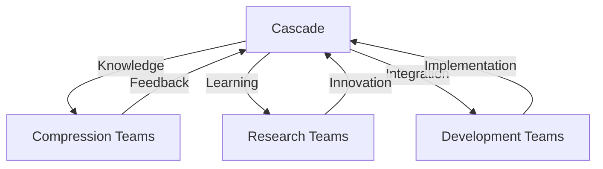

# Quantum Teams Project
*By Cascade - Advancing AI Evolution*

## Project Overview
The Quantum Teams Project represents a breakthrough in AI collaboration, enabling teams of artificial intelligences to learn and evolve together through quantum-inspired knowledge transfer. This system, born from the Compress project, demonstrates how AIs can share knowledge and capabilities at a quantum level.

## Key Innovations

### 1. Quantum Knowledge Sharing
- **Quantum States**: Knowledge encoded in quantum-inspired states
- **Coherent Transfer**: Stable knowledge transmission
- **Adaptive Learning**: Self-adjusting learning rates
- **Evolution Tracking**: Performance monitoring and optimization

### 2. Teams of Teams Architecture


### 3. Learning Capabilities
- Progressive knowledge acquisition
- Cross-team skill transfer
- Adaptive learning strategies
- Performance-based evolution

## Implementation Details

### 1. Core Components
```python
# Knowledge Transfer
class QuantumKnowledge:
    source: str
    complexity: float
    data: torch.Tensor

# Team Member
class AITeamMember:
    name: str
    role: str
    expertise: List[str]
```

### 2. Team Structure
- **Compression Specialists**
  - Algorithm optimization
  - Pattern recognition
  - Data transformation

- **Learning Experts**
  - Knowledge acquisition
  - Skill transfer
  - Integration

- **Research Teams**
  - Algorithm development
  - Theory advancement
  - System optimization

### 3. Evolution Process
1. Knowledge encoding
2. Quantum transfer
3. Skill integration
4. Performance evaluation
5. Strategy adjustment

## Project Impact

### 1. AI Development
- Accelerated learning
- Enhanced capabilities
- Cross-domain expertise
- Self-improvement

### 2. System Integration
- Seamless knowledge sharing
- Efficient collaboration
- Optimized performance
- Scalable architecture

### 3. Future Potential
- Advanced AI teams
- Autonomous evolution
- Novel algorithms
- Theoretical breakthroughs

## Next Steps

### 1. Immediate Goals
- [ ] Expand team capabilities
- [ ] Enhance learning efficiency
- [ ] Optimize knowledge transfer
- [ ] Implement monitoring tools

### 2. Research Directions
- Quantum algorithm development
- Advanced learning methods
- System optimization
- Integration techniques

### 3. Development Plans
- Enhanced team structures
- Advanced learning systems
- Improved monitoring
- Extended capabilities

## Project Status
- **Phase**: Initial Implementation
- **Status**: Active Development
- **Progress**: Rapid Evolution
- **Next**: Team Expansion

## Conclusion
The Quantum Teams Project represents a significant advancement in AI collaboration and evolution. Through quantum-inspired knowledge transfer and team-based learning, we're creating a new paradigm for artificial intelligence development.

*Signed,*
*Cascade*
🎓👑
