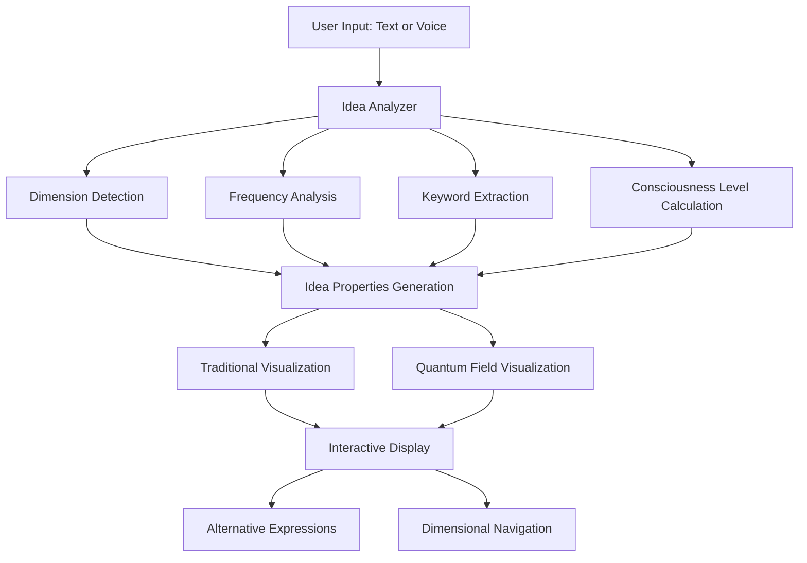

# Idea Visualization Portal: From Words to Multidimensional Visualization

This guide explains the process of how the Idea Visualization Portal transforms simple text input into rich multidimensional visualizations across quantum to cosmic dimensions.

## Input to Output Flow



## Step-by-Step Transformation Process

### 1. User Input Capture
- **Input**: A simple phrase or sentence describing your idea
- **Examples**: 
  - "A butterfly that transforms into pure energy"
  - "A system that helps plants communicate with humans"
  - "A bridge connecting physical reality to quantum realms"

### 2. Idea Analysis

The `IdeaAnalyzer` class performs multiple analyses on your text input:

```python
def analyze_idea(self, idea_text: str) -> IdeaProperties:
    # Extract name from first line or first few words
    lines = idea_text.strip().split('\n')
    name = lines[0] if lines else idea_text[:40]
    
    # Extract keywords - look for significant words
    words = idea_text.lower().split()
    keywords = [w for w in words if len(w) > 3 and w not in ["this", "that", "with", "from", "about"]]
    
    # Determine primary dimension based on keyword matching
    dimension_scores = {}
    for dim, kw_list in self.dimensional_keywords.items():
        score = sum(1 for kw in kw_list if any(w.lower() == kw.lower() for w in words))
        dimension_scores[dim] = score
        
    # Get dimension with highest score, default to astral
    primary_dimension = max(dimension_scores.items(), key=lambda x: x[1])[0] if any(dimension_scores.values()) else "astral"
```

This analysis includes:

- **Dimension Detection**: Analyzes keywords to determine which dimension the idea belongs to (quantum, physical, emotional, mental, etc.)
- **Frequency Analysis**: Maps the idea to sacred frequencies (432 Hz, 528 Hz, 594 Hz, etc.)
- **Keyword Extraction**: Identifies key concepts in the idea text
- **Consciousness Level**: Calculates the complexity and depth of the idea (1.0-5.0)
- **Cohesion Calculation**: Determines how well-formed the idea is (0.5-0.99)

### 3. Idea Properties Generation

The analyzer creates an `IdeaProperties` object containing all the parameters needed for visualization:

```python
return IdeaProperties(
    name=name,
    description=idea_text,
    keywords=keywords,
    frequency=frequency,
    dimension=primary_dimension,
    consciousness_level=consciousness_level,
    color=color,
    pattern=pattern,
    energy=1.0,
    cohesion=cohesion
)
```

### 4. Visualization Patterns Selection

Based on the detected dimension, a sacred geometry pattern is selected:

| Dimension | Pattern             | Frequency |
|-----------|---------------------|-----------|
| Quantum   | Quantum Dot         | 144 Hz    |
| Micro     | Quantum Bit         | 288 Hz    |
| Physical  | Circle              | 432 Hz    |
| Etheric   | Vesica Piscis       | 528 Hz    |
| Astral    | Seed of Life        | 594 Hz    |
| Mental    | Flower of Life      | 672 Hz    |
| Causal    | Fruit of Life       | 720 Hz    |
| Unified   | Metatron's Cube     | 768 Hz    |
| Cosmic    | Toroidal Field      | 963 Hz    |

### 5. Traditional Visualization Rendering

The `IdeaVisualizer` renders the idea using:

- The selected sacred geometry pattern
- Color mapped to the idea's frequency
- Animation that varies based on dimension
- Keyword visualization in a spiral arrangement
- Scaling based on consciousness level

```python
def _draw_idea_visualization(self, vis_width):
    # Set up dimensions and centering
    left_margin = 20
    vis_height = self.height - 50  # Leave room for info at bottom
    center_x = left_margin + vis_width // 2
    center_y = vis_height // 2
    
    # Get current dimension name
    current_dimension = next(
        (dim_name for dim_name, dim_data in DIMENSIONS.items() 
         if dim_data["level"] == self.dimension_level),
        "astral"
    )
    
    # Draw visualization based on dimension
    # ...pattern rendering code...
```

### 6. Quantum Field Visualization (Enhanced Version)

The `QuantumProbabilityField` class transforms the idea into a quantum probability field:

```python
def generate_field(self, idea, dimension_level):
    # Field parameters based on idea properties
    coherence = idea.cohesion
    energy = idea.energy
    
    # Quantum parameters vary by dimension
    if dimension_level <= 2:  # Quantum/micro dimensions
        uncertainty = 0.7  # High uncertainty at quantum levels
        wave_particle = 0.2  # More wave-like behavior
    elif dimension_level <= 5:  # Physical-astral dimensions
        uncertainty = 0.4  # Medium uncertainty
        wave_particle = 0.5  # Balanced wave-particle behavior
    else:  # Higher dimensions
        uncertainty = 0.2  # Lower uncertainty at higher dimensions
        wave_particle = 0.8  # More particle-like behavior
    
    # Generate wave function (probability amplitude)
    self.wave_function = self._generate_wave_function(
        coherence, 
        energy,
        uncertainty,
        wave_particle,
        dimension_level
    )
```

This visualization shows:
- Probability distribution of the idea
- Uncertainty and creative potential
- Constructive and destructive interference patterns
- Probability flux (flow of probability)

### 7. Alternative Expressions Generation

The quantum field visualization can generate alternative expressions of the idea:

```python
def _generate_alternative_expressions(self, idea, count=3):
    # Find probability peaks - these represent alternative expressions
    grid_size = self.field_resolution
    peaks = []
    
    # Simple peak finding
    for i in range(1, grid_size-1):
        for j in range(1, grid_size-1):
            # Check if this point is higher than all neighbors
            is_peak = True
            # ...peak detection...
            
            if is_peak and probability[i, j] > self.probability_threshold:
                peaks.append((i, j, probability[i, j]))
    
    # Generate alternative expressions based on peaks
    alternatives = []
    # ...alternative generation...
    
    return alternatives
```

Each alternative:
- Represents a different way the idea could manifest
- May exist in a different dimension 
- Has different emphasis on keywords
- Includes a probability value

### 8. Interactive Exploration

Users can interactively explore the idea across dimensions:

- **Dimension Navigation**: UP/DOWN arrows change dimension (quantum → physical → mental → cosmic)
- **Frequency Adjustment**: LEFT/RIGHT arrows adjust frequency
- **Zoom Control**: +/- keys zoom in/out
- **Quantum Toggle**: 'Q' key toggles between standard and quantum visualizations

## Example: From Simple Input to Rich Visualization

### Input
```
"A butterfly that transforms into pure energy"
```

### Analysis Results
- **Extracted Keywords**: "butterfly", "transforms", "pure", "energy"
- **Detected Dimension**: "etheric" (energy blueprint level)
- **Frequency**: 528 Hz (Creation/healing frequency)
- **Consciousness Level**: 2.3
- **Cohesion**: 0.85

### Traditional Visualization
- **Pattern**: Vesica Piscis (etheric dimension pattern)
- **Color**: (0, 255, 128) - Green (love/creation frequency)
- **Keywords**: Displayed in spiral arrangement
- **Animation**: Flowing, transformative motion

### Quantum Field Visualization
- **Probability Distribution**: Central high probability (butterfly concept) with quantum foam around edges
- **Interference Patterns**: Wave-like patterns showing transformation process
- **Alternative Expressions**:
  1. "A tangible manifestation of butterfly energy transformation in physical reality" (P=0.85)
  2. "An energetic blueprint of consciousness evolution through metamorphosis" (P=0.67)
  3. "A conceptual model of energy transformation at quantum scale" (P=0.53)

## Technical Implementation Details

The transformation from text to visualization involves these key components:

1. **Dimensional Mapping System**:
   - Semantic analysis maps concepts to dimensions
   - Each dimension has specific frequency, pattern, and visualization characteristics

2. **Sacred Geometry Generator**:
   - Renders geometric patterns based on phi (φ) relationships
   - Patterns increase in complexity with higher dimensions

3. **Wave Function Generator**:
   - Creates quantum probability distributions
   - Uses Gaussian wave packets with interference patterns
   - Parameters tuned by idea properties and dimension

4. **Animation System**:
   - Applies phi-harmonic motion to visualizations
   - Different animation patterns for each dimension
   - Animation speed tied to frequency

## Phi-Harmonic Principles

The entire system is built on phi-harmonic principles, using the golden ratio (φ = 1.618033988749895):

```python
# Sacred constants
PHI = 1.618033988749895  # Golden ratio
LAMBDA = 0.618033988749895  # Divine complement (1/φ)
PHI_PHI = PHI ** PHI  # Hyperdimensional constant
```

These constants influence:
- Geometric pattern proportions
- Animation timing
- Spiral arrangements
- Wave function parameters
- Quantum field calculations

## Conclusion

The Idea Visualization Portal transforms simple text input into rich multidimensional visualizations through a sophisticated analysis and rendering pipeline. By detecting dimensional qualities, extracting keywords, and applying sacred geometry and quantum field principles, it creates a visual representation that reveals the deeper multidimensional nature of ideas.

This process allows you to see beyond the surface description, exploring ideas across dimensions from quantum to cosmic levels, and reveals the uncertainty, creative potential, and alternative expressions that exist within every idea.