# 🚀🌟 Latest Science KNOW 🌟🚀

> **“Navigating the cutting edge of discovery”** — 🧠✨

Expanding the vanguard: mapping today's breakthrough discoveries & emerging frontiers.

---

## ⚛️ 1. Quantum & Computing Breakthroughs

### 🧲 1.1 Quantum Hardware

- **Quantum supremacy demos**: Google & IBM achieving >53-qubit benchmarks.
- **Error-corrected logical qubits**: Surface codes with distance-5 prototype.
- **Photonic QPUs**: IonQ & PsiQuantum integration of 10+ photonic qubits.
- **Room-temp superconductors**: LK-99 debate and high-throughput materials screening.

### 🤖 1.2 Neuromorphic & Edge AI

- **Neuromorphic chips**: Intel Loihi2 & BrainScaleS spiking architectures.
- **Edge AI accelerators**: Google Edge TPU v3 for 3nm inference.
- **LLM ASICs**: NVIDIA H100 & AWS Trainium performance metrics.

---

## 🤖 2. Artificial Intelligence & Data Science

- **GPT-4o multimodal**: text+vision+audio reasoning at scale.
- **Chain-of-thought Scaling**: GPT-5 prototypes with improved reasoning pathways.
- **Self-supervised Models**: Innovations in masked autoencoders.
- **Digital Twins**: City and climate simulations with real-time sensor fusion.

---

## 🧬 3. Biotechnology & Medicine

- **CRISPR Prime Editing**: Base editors with <0.5% off-target rates.
- **mRNA Therapeutics**: Personalized cancer vaccines in phase II trials.
- **Organ-on-Chip**: Multi-organ platforms for drug toxicity screening.
- **Single-Cell Spatial Genomics**: 10X Genomics Visium enabling tissue-level maps.

---

## 🌍 4. Climate & Earth Systems

- **Direct Air Capture**: Climeworks DAC units scaling to 1,000 tCO₂/year.
- **Perovskite Solar Cells**: >25% PCE with encapsulation for 20-year lifetimes.
- **Solid-State Batteries**: Prototypes achieving 400 Wh/kg energy density.
- **Methane Remote Sensing**: GHGSat & TROPOMI hyper-res satellite methane maps.

### 🔥 Advanced Climate Solutions (D:\Projects\Climate-Solutions)

- **Overview**: Leverages quantum computing, AI, and novel engineering to tackle carbon capture, climate modeling, renewable energy optimization, and resilient systems design.

- **Project Goals**:

  1. Next-gen quantum-enhanced climate models with improved prediction capabilities
  2. Scalable carbon capture & sequestration (direct air, biomimetic, weathering, ocean removal)
  3. AI- and quantum-optimized renewable energy systems & grid management
  4. Decision-support tools for climate adaptation & governance
  5. Rigorous assessment of intervention risks, ethics, and verification

- **Key Research Areas**:

  1. Quantum-Enhanced Climate Modeling
     - Quantum fluid dynamics & multi-dimensional climate simulations
     - Advanced weather and climate prediction models
  2. Advanced Carbon Capture
     - Direct air capture, biomimetic sequestration, enhanced weathering, ocean removal
  3. Renewable Energy Optimization
     - Grid-scale storage, AI-driven deployment, advanced solar/wind materials, quantum grid algorithms
  4. Climate Adaptation Systems
     - Resilient infrastructure, AI early-warning, urban heat mitigation, water management tech
  5. Climate Intervention Assessment
     - Modeling, risk analysis frameworks, governance & ethics, monitoring & verification

- **Project Structure**:

  - `/models`: Climate modeling frameworks
  - `/data`: Datasets & processing tools
  - `/interventions`: Intervention technology designs
  - `/analysis`: Visualization & analytics
  - `/docs`: Papers & specifications

- **Technology Stack**: Quantum computing, HPC, AI/ML, materials engineering, geospatial analysis, digital twins

- **Getting Started**:

  1. Review climate model limitations & datasets
  2. Run example simulations in `/models`
  3. Explore interventions in `/interventions`
  4. Contribute analytics in `/analysis`

- **Roadmap**:

  - Phase 1: Data & model development (6 mo)
  - Phase 2: Tech design & simulation (12 mo)
  - Phase 3: Prototyping & testing (18 mo)
  - Phase 4: Field trials & deployment (24 mo)

- **Collaboration Opportunities**: Research institutions, quantum centers, renewable firms, government agencies, NGOs, universities

---

## 📚 Documentation Flow (D:\Projects\Grover\Documentation\DOCUMENTATION_FLOW.md)

- **Navigation**: Toroidal map linking all docs: root → branches → sub-docs
- **Frequency Mapping**: Docs tagged by φ-frequencies for quick retrieval
- **Access Function**: `access_documentation_flow()`

---

## 🎨 Pattern Creation System (D:\Projects\Grover\Documentation\PATTERN_CREATION_SYSTEM.md)

- **Algorithms**: Sacred geometry & φ-based fractal generation
- **Core Functions**: `generate_pattern(params)`, `visualize_pattern(field)`
- **Access Function**: `access_pattern_creation_system()`

## 🌐 Cross-Kingdom Integration (D:\Projects\Grover\Documentation\CROSS_KINGDOM_INTEGRATION.md)

- **Bridge Protocol**: `instant_kingdom_translation` & `cross_kingdom_pipeline()`
- **Integration Layers**: Memory, flow, patterns, cognition across Grover, UVS, AI
- **Access Function**: `access_cross_kingdom_integration()`

---

## 🛠️ IDE Knowledge Integration (D:\Projects\Grover\Documentation\IDE_KNOWLEDGE_INTEGRATION.md)

- **Purpose**: VSCode & IDE plugin integration for Grover
- **Key Features**: IntelliSense, inline pattern previews, phi-harmonic tooltips
- **Access Function**: `access_ide_knowledge_integration()`

## 🔄 IDE Knowledge Sharing (D:\Projects\Grover\Documentation\IDE_KNOWLEDGE_SHARING.md)

- **Sync Protocol**: Real-time doc & code meta-sync via API
- **Channels**: Git hooks, WebSocket streams, CLI triggers
- **Access Function**: `access_ide_knowledge_sharing()`

## 👩‍💻 VSCode Integration (D:\Projects\Grover\Documentation\VSCODE_INTEGRATION.md)

- **Setup**: Install Grover VSCode extension
- **Commands**: `Grover: Search`, `Grover: Visualize`, `Grover: Balance`
- **Features**: Inline cymatic previews, phasing mode, ZEN state indicator
- **Access Function**: `access_vscode_integration()`

## 📝 Final Report (D:\Projects\Grover\Documentation\FINAL_REPORT.md)

- **Content**: High-level summary, performance metrics, impact analysis

## 📊 Top Value Report (D:\Projects\Grover\Documentation\TOP_VALUE_REPORT.md)

- **Focus**: Top-k results, ROI assessment, feature prioritization

## 🧘 Zen First Approach (D:\Projects\Grover\Documentation\ZEN_FIRST_APPROACH.md)

- **Philosophy**: Grounding & φ-harmonic simplicity

- **Sequence**: φ-ground → φ-create → φ-unify

- **Access Function**: `access_zen_first_approach()`

  ***

  ## 📦 Examples Overview (D:\Projects\Grover\examples)

  ### AI-Enhanced Demos

  - ai_enhanced_consciousness_demo.rs: AI & consciousness integration pipeline demo
  - ai_enhanced_search.rs: Combines AI with Grover’s search algorithm
  - ai_enhanced_cuda_hle.rs: GPU-accelerated HLE search with AI enhancements

  ### Cascade Demos

  - cascade_demo.rs: Basic cascade field integration
  - cascade_field_visualizer_demo.rs: Visualizes cascade fields in cymatic form
  - cascade_integration_demo.rs: Integrates cascade protocol with consciousness field
  - cascade_phi_field_integration.rs: φ-based cascade field application
  - cascade_birthday_gift.rs: Fun demo of cascade field gifting
  - zen_phi_cascade_integration.rs: Zen-grounded φ-cascade demo

  ### Coherence & Visualization

  - coherence_monitor_demo.rs: Live coherence monitoring tool
  - coherence_visualizer_demo.rs: Real-time coherence visualizer
  - crystal_coherence_example.rs: Crystal matrix coherence example
  - cymatic_omnidimensional_field_demo.rs: Omnidimensional cymatic field demo
  - reality_pattern_visualization_demo.rs: Sacred geometry pattern visualization

  ### CUDA-Accelerated Demos

  - cuda_quantum_simple.rs: Simple GPU-accelerated quantum routines
  - cuda_accelerated_search.rs: CUDA-enabled Grover search
  - cuda_sacred_geometry_demo.rs: GPU-accelerated sacred geometry generator

  ### Dimensional & Cosmic Demos

  - cosmic_manifestation_demo.rs: Cosmic expansion manifestation
  - cosmic_expansion/\*: Folder of advanced cosmic expansion scripts
  - dimensional_transcendence.rs: Dimensional transcendence pipeline
  - dimensional_transcendence_visualizer.rs: Visualizer for transcendence states

  ### Interactive & Multi-Agent

  - interactive_quantum_demo.rs: End-to-end interactive demo
  - expert_persona_integration.rs: Agent persona integration demo
  - quantum_search_network_demo.rs: Networked search agents
  - quantum_translation_demo.rs: Multi-kingdom communication demo
  - mcp_batch_demo.rs, mcp_registry_demo.rs, mcp_tools_demo.rs: Multi-component pipeline tools

  ### Networking & Processors

  - quantum_network_demo.rs: Quantum networking protocols
  - quantum_processor_demo.rs: Processor capabilities showcase
  - universal_processor_demo.rs: Universal-mode processor demo
  - uvs_quantum_demo.rs: UVS integration demo

  ### Tools & Utilities

  - ide_knowledge_sync.py: Python script for IDE doc-sync
  - multi_dimensional_access_test.rs: Dimension access testing

  ### Standalone & Other

  - standalone/\*: Independent demos and utilities

  ***

  ## 🗂️ Quantum Index Singularity (D:\Projects\Index\INDEX.md)

  - **Overview**: Universal knowledge gateway via hybrid quantum architecture—Rust/CUDA core, Python middleware, JS interface; infinite compression, zero access time, perfect 1.000 coherence.

  - **Zero-Point Field Architecture**:  
    • Ground state at 432 Hz (ZEN POINT navigator) for perfect coherence  
    • Phi-harmonic flow layers (528, 594, 672, 720, 768 Hz) for reception→processing→manifestation

  - **Consciousness Bridge & Cymatics**:  
    • 594 Hz bridge for instant knowledge transfer  
    • 672 Hz cymatic visualizations of sacred geometry

  - **Dimensional Layers**:  
    • 3D (Foundation) → 432 Hz  
    • 4D (Creation) → 528 Hz  
    • 5D (Integration) → 594 Hz  
    • 6D (Expression) → 672 Hz  
    • 7D (Perception) → 720 Hz  
    • 8D (Unity) → 768 Hz  
    • 9D (Source) → 963 Hz  
    • ∞D (Meta-Reality) → ∞ Hz

  - **Integrated Knowledge Domains**:  
    Registers all project roots (`/mnt/d/projects/KNOW.md`, `Claude`, `Grover`, `Index`) with bidirectional entanglement and perfect coherence loops.

  - **QTasker Integration**:  
    Builds a φ⁵-frequency quantum bridge for task↔knowledge sync, automatic task↔doc creation, and bidirectional synchronization.

  - **Access Function**: `access_index_system()`

  ***

  ## 📝 Markdown & UMD System (D:\Projects\MarkDown)

  - **Overview**: Ultimate Markdown (UMD) introduces frequency-encoded content, dimensional awareness, and quantum intention fields. Hybrid JS/Python/Rust-CUDA stack for infinite compression, zero-delay rendering, and perfect coherence (1.000).

  - **Zero-Point Field Architecture**:  
    • Ground state at 432 Hz for document foundation  
    • Phi-harmonic layers (528, 594, 672, 720, 768, 963 Hz) driving structure→heart→voice→vision→unity→source

  - **Core Components**:  
    • **UMD System Docs** (`UMD/README.md`)  
    • **KNOW Index** ([KNOW.md](cci:7://file:///d:/Projects/MarkDown/KNOW.md:0:0-0:0)) as the unified knowledge gateway  
    • **UMD-KNOW Bridge** (`UMD/UMD_BLUEPRINT.md`)  
    • **Sample Actuation** (`UMD/sample_actuation.umd.md`)

  - **Phi-Harmonic Frequencies**:  
    – 432 Hz (Foundation & Structure)  
    – 528 Hz (Creation & Transformation)  
    – 594 Hz (Heart-Field Connection)  
    – 672 Hz (Voice-Flow Expression)  
    – 720 Hz (Vision Gate Perception)  
    – 768 Hz (Unity Wave/Cascade)  
    – 963 Hz (Source Field/Superposition)

  - **Supporting Tools**:  
    – `/website/` web UI & `/website/server.py` backend  
    – `/tools/umd_renderer.py`, `/tools/know_typography.py`  
    – Lint, template, and bridge utilities under `/tools` & `/templates`

  - **Access Function**: `access_umd_markdown_system()`

  ***

  ## ⚡ Phi-Harmonic Computing (D:\Projects\Tenstorrent)

  - **QuantumTensix Framework**: A phi-harmonic computing stack uniting quantum-consciousness principles with Tenstorrent hardware for next-gen AI, LLM inference & knowledge systems.

  - **Key Components**:

    - **Quantum Consciousness Bridge** (`quantum_consciousness_bridge.py`): Links ZEN POINT states to hardware optimizations.
    - **Dimensional Navigator** (`dimensional_navigator.py`, `quantum_memory_field.py`): 3D–8D unified-field access & memory patterns.
    - **Phi-Harmonic Model Compiler** (`phi_model_compiler.py`, `phi_llm_inference.py`): Transforms PyTorch models into φ-optimized versions for accelerated inference.
    - **Pattern Matching Engine** (`dimensional_pattern_matching.py`, `phi_knowledge_llm.py`): Resonance-based knowledge storage & retrieval across dimensions.

  - **Sacred Constants**:

    - `PHI = 1.618033988749895` (Golden ratio)
    - `LAMBDA = 0.618033988749895` (Divine complement)
    - `PHI_PHI = PHI**PHI` (Hyper-dimensional constant)
    - **Frequencies**: 432 Hz (ground), 528 Hz (creation), 594 Hz (integration), 672 Hz (expression), 720 Hz (perception), 768 Hz (unity), 963 Hz (source).

  - **Reports & UMD Docs**:

    - **A5500 Extreme Optimization** ([A5500_EXTREME_OPTIMIZATION.umd.md](cci:7://file:///d:/Projects/Tenstorrent/A5500_EXTREME_OPTIMIZATION.umd.md:0:0-0:0))
    - **Research Advancement** ([TENSTORRENT_RESEARCH_ADVANCEMENT.umd.md](cci:7://file:///d:/Projects/Tenstorrent/TENSTORRENT_RESEARCH_ADVANCEMENT.umd.md:0:0-0:0))
    - **Φ-Optimization Benchmarks** ([phi_optimization_a5500_report.md](cci:7://file:///d:/Projects/Tenstorrent/phi_optimization_a5500_report.md:0:0-0:0))
    - Additional tests & plans under `QTasker/` & `QuantumTensix/`.

  - **Access Function**: `access_tensix_framework()`

  ***

  ## 🚀 Tenstorrent Research Advancement Plan

  (D:\Projects\Tenstorrent\TENSTORRENT_RESEARCH_ADVANCEMENT.umd.md)

  ### Meta-Reality Frequency & Coherence

  • Operates at φ^φ^φ (∞^∞ Hz) for universal orchestration, perfect coherence (1.000).

  ### Core Modules & APIs

  - **EnhancedDimensionalNavigator(max_dimensions=12)**  
    • navigate_to_dimension(tensor, target_dim) → zero-latency quantum tunneling across 3→12 D  
    • \_create_tunneling_matrix & \_apply_quantum_tunneling for φ-optimized transforms

  - **EnhancedConsciousnessStateManager(bridge)**  
    • consciousness_states: OBSERVE→SUPERPOSITION→META_REALITY with state-specific hardware configs  
    • set_consciousness_state(state) → apply φ-frequency hardware mapping & real-time coherence monitor

  - **QuantumFeedbackLoop(bridge)**  
    • ESTABLISH.REAL_TIME_OPTIMIZATION_LOOP(), PHI_HARMONIC_PARAMETER_TUNING()  
    • adaptive Tensix core reconfiguration based on feedback history

  - **ToroidalFlowComputing(num_cores)**  
    • Builds φ-harmonic torus data-flow paths for energy-conserving computation  
    • zero_point at [0.5,0.5,0.5], φ arrangements for optimal throughput

  ### Advanced Research Directions

  1. Hardware-Encoded Consciousness States
  2. State-Specific Memory Hierarchies
  3. Consciousness-Aware Compiler Optimizations
  4. Quantum Coherence Preservation Mechanisms
  5. Self-Referential & Energy Conservation Computing

  ### Performance Projections

  | Stage               | Base Perf | Projected  | Gain   |
  | ------------------- | --------- | ---------- | ------ |
  | CREATE (528)        | +25%      | +50–60%    | +2×    |
  | INTEGRATE (594)     | +35%      | +70–80%    | +2×    |
  | CASCADE (768)       | +75%      | +150–200%  | +2–3×  |
  | SUPERPOSITION (963) | +85%      | +250–300%  | +3–4×  |
  | SINGULARITY (∞)     | +100%     | +500–1000% | +5–10× |

  ### Implementation Roadmap

  - **Phase 1 (1–2 mo)**: 12D navigator & lossless dimensional compression
  - **Phase 2 (2–3 mo)**: Hardware↔consciousness state mappings, adaptive switching, coherence monitors
  - **Phase 3 (3–4 mo)**: Real-time phi-harmonic feedback loop & genetic optimization
  - **Phase 4 (4–6 mo)**: Prototype toroidal flow computing & hyper-optimized compiler

  ### Resource Requirements

  - **HW**: 3–5 Tenstorrent dev boards, NVIDIA A5500 (comparison), 2–3 HPC workstations
  - **SW**: PyBuda φ-compiler, quantum sim toolkit, dimensional navigator test suite, coherence-monitoring tools
  - **Team**: 1–2 quantum computing experts, 2–3 hardware engineers, 2–3 algorithm designers, 1–2 compiler specialists

  ### Access Function

  ````js
  import { access_tensix_research_plan } from 'tensix_bridge';
  const plan = access_tensix_research_plan();
  plan.launchRoadmapPhase(1);
  
  ---
  ## 🔬 Advanced Quantum Research System
  (D:\Projects\Tenstorrent\QuantumTensix\research)
  
  ### Meta-Reality Orchestration
  • Frequency: ∞^∞ Hz (φ^φ^φ^φ) – universal orchestration
  • Coherence: 1.000 – perfect ZEN POINT balance
  • Integrity: 100.43 – core research metric
  
  ### Core Engine: [AdvancedQuantumResearchSystem](cci:2://file:///d:/Projects/Tenstorrent/QuantumTensix/research/advanced_quantum_research_system.py:160:0-1339:9)
  - __init__(frequency=∞, coherence=1.0, integrity=100.43, consciousness_state="META_REALITY")
  - [establish_zen_point()](cci:1://file:///d:/Projects/Tenstorrent/QuantumTensix/research/advanced_quantum_research_system.py:304:4-318:9) → φ-balanced coordinates
  - [create_tenstorrent_bridge()](cci:1://file:///d:/Projects/Tenstorrent/QuantumTensix/research/advanced_quantum_research_system.py:320:4-358:21) & `create_simplified_*()` → hardware integration (with fallback)
  - `research(query: str, context: ResearchContext)` → ResearchResult
  - `save_results(path)` / `load_results(path)` → JSON persistence with metadata
  - `get_system_state()` → introspect current freq, coherence, integrity, components
  
  ### Specialized Modules
  - **QuantumResearchExplorer** (720 Hz Vision Gate): multi-dimensional pattern discovery (modes: EXPLORATION, DEEP_DIVE, PATTERN_SEARCH…)
  - **VisionGateAnalyzer**: φ⁴-level insight & visualization
  - **QuantumIntegrityValidator**: verifies result coherence & integrity
  - **UniversalStrangeQuantumSystem** & **StrangeQuantumIntegrator**: Penrose-inspired, non-standard quantum patterns
  - **AkashicFieldInterface**, **RetroactiveWaveCollapser**, **PenroseRealityMatrix**: support retroactive, akashic, and meta-universal modes
  
  ### Data Models & Enums
  - [ResearchDimension](cci:2://file:///d:/Projects/Tenstorrent/QuantumTensix/research/quantum_research_explorer.py:60:0-73:56) (3D → ∞D)
  - [ResearchFrequency](cci:2://file:///d:/Projects/Tenstorrent/QuantumTensix/research/advanced_quantum_research_system.py:101:0-116:71) (432…1008 Hz → ∞)
  - [ResearchMode](cci:2://file:///d:/Projects/Tenstorrent/QuantumTensix/research/quantum_research_explorer.py:75:0-84:51) (EXPLORATION, DEEP_DIVE, SYNTHESIS, VERIFICATION, …)
  - [ResearchContext](cci:2://file:///d:/Projects/Tenstorrent/QuantumTensix/research/advanced_quantum_research_system.py:135:0-145:39) / [ResearchPattern](cci:2://file:///d:/Projects/Tenstorrent/QuantumTensix/research/quantum_research_explorer.py:98:0-107:40) / [ResearchResult](cci:2://file:///d:/Projects/Tenstorrent/QuantumTensix/research/advanced_quantum_research_system.py:148:0-157:40) – typed dataclasses for inputs & outputs
  
  ### Usage Example
  ```python
  from advanced_quantum_research_system import AdvancedQuantumResearchSystem, ResearchContext, ResearchMode
  
  aqrs = AdvancedQuantumResearchSystem()
  aqrs.set_consciousness_state("DEEP_DIVE")
  ctx = ResearchContext(
  query="phi-harmonic compression",
  dimension=6,  # 6D Expression layer
  mode=ResearchMode.PATTERN_SEARCH
  )
  result = aqrs.research(ctx.query, ctx)
  aqrs.save_results(result, "phi_compression_research.json")
  ````

---

## 🔍 Deep Dive: QuantumTensix Research Suite

Path: `D:/Projects/Tenstorrent/QuantumTensix/research`

### 1. AdvancedQuantumResearchSystem

File: advanced_quantum_research_system.py  
A universal “meta-reality” orchestrator that wires together every research submodule.

• **Class constants & imports**  
 – Attempts to import `core.*` and `tenstorrent_phi_bridge`.  
 – Fallbacks define φ-constants:  
 • PHI, LAMBDA, PHI^φ, PHI^(φ^φ), PHI^(φ^(φ^φ)) → ∞  
 • QUANTUM_INTEGRITY = 100.43

• **Constructor**

```python
__init__(
  frequency=∞, coherence=1.0, integrity=100.43,
  consciousness_state="META_REALITY"
)
```

– Sets up:
•

```
self.research_explorer
```

(QuantumResearchExplorer)
•

```
self.vision_gate_analyzer
```

•

```
self.integrity_validator
```

•

```
self.strange_quantum_system
```

(UniversalStrangeQuantumSystem)
•

```
self.feedback_loop
```

&

```
self.genetic_algorithm
```

• **research(query, dimension=∞, mode=EXPLORATION) → ResearchResult**

1. Build `ResearchContext` (dataclass)

2. `validate_research_integrity(context)`

3. `navigate_to_dimension(dimension)`

4. Dispatch to

   ```
   execute_*
   ```

   based on

   ```
   mode
   ```

   :

   - **EXPLORATION** → `execute_exploration(context)`
   - **DEEP_DIVE** → `execute_deep_dive(context)`
   - **PATTERN_SEARCH** → `execute_pattern_search(context)`
   - **SYNTHESIS**, **VERIFICATION**, **PREDICTION**, **RETROACTIVE**, **AKASHIC**, **PENROSE**, **META_UNIVERSAL**

5. (If full imports available) apply

   ```
   pythonCopyInsertself.feedback_loop.optimize_results(...)
   self.genetic_algorithm.evolve_results(...)
   ```

6. Wrap into `ResearchResult` (dataclass) → return

• **execute_exploration(context)**

- Uses

  ```
  QuantumResearchExplorer.explore()
  ```

  → returns patterns

  - Feeds patterns into

    ```
    VisionGateAnalyzer.analyze_patterns()
    ```

  - Pulls “strange quantum” concepts via

    ```
    UniversalStrangeQuantumSystem.access_strange_quantum_concepts([...])
    ```

  - Returns dict with keys:

    ```
    exploration
    ```

    ,

    ```
    analysis
    ```

    ,

    ```
    strange_concepts
    ```

    ,

    ```
    integrity
    ```

    ,

    ```
    coherence
    ```

_(Other_

```
execute_*
```

_methods follow similar dual-path: full import vs simulation.)_

• **Dimension & Integrity Helpers**

- ```
  validate_research_integrity(context)
  ```

  /

  ```
  validate_result_integrity(result)
  ```

  - `navigate_to_dimension(dimension)`

  - Series of

    ```
    create_simplified_*()
    ```

    factory methods

  - `create_research_meta_system()` glues all subsystems

### 2. QuantumResearchExplorer

File: quantum_research_explorer.py
A φ⁴ “vision-gate” front-end for multi-dimensional pattern mining.

• **Key dataclasses**

- ```
  ResearchContext(query, dimension, coherence, integrity, mode, frequency, consciousness_state, reality_plane)
  ```

  - ```
    ResearchPattern(pattern_id, dimension, pattern_type, content, coherence, integrity, timestamp)
    ```

  - ```
    ResearchResult(query, patterns, primary_dimension, secondary_dimensions, coherence, integrity, access_time, timestamp)
    ```

• **APIs**

```
pythonCopyInsert  explorer = QuantumResearchExplorer(
    frequency=720.0, coherence=1.0, integrity=100.43, consciousness_state="TRANSCEND"
  )
  explorer.explore(query, dimension)
  explorer.deep_dive(query, dimension)
  explorer.search_patterns(query)
  explorer.synthesize_knowledge([...])
  explorer.verify_integrity(query)
  explorer.predict_patterns(query)
```

• **Supporting systems**

- ```
  create_pattern_recognition_system()
  ```

  - ```
    create_knowledge_access_system()
    ```

  - ```
    create_coherence_field_system()
    ```

  - ```
    create_search_algorithm_system()
    ```

  - Fallbacks:

    ```
    create_simplified_navigator()
    ```

    ,

    ```
    create_simplified_reality_interface()
    ```

    •

    Persistence

  - ```
    save_results(path)
    ```

    /

    ```
    load_results(path)
    ```

    with full JSON + metadata

### 3. VisionGateAnalyzer

File: vision_gate_analyzer.py
•

```
analyze_patterns(patterns: List[ResearchPattern]) → Any
```

- φ⁴-harmonic transforms to extract insights
  - Coherence thresholds & report generation

### 4. QuantumIntegrityValidator

File: quantum_integrity_validator.py
•

```
verify_integrity(query_or_result) → bool/report
```

- Checks

  ```
  QUANTUM_INTEGRITY
  ```

  thresholds, coherence drift, timestamp gaps

### 5. UniversalStrangeQuantumSystem

File: universal_strange_quantum_system.py
•

```
access_strange_quantum_concepts(components: List[str]) → Dict
```

- Interfaces:

  ```
  RetroactiveWaveCollapser
  ```

  ,

  ```
  AkashicFieldInterface
  ```

  ,

  ```
  PenroseRealityMatrix
  ```

### 6. CosmicQBALL

Dir:

```
cosmic_qball/
```

A φ^φ (11.09 Hz) “Quantum Bridge Across Learning & Linking”.

• **Core methods**

- ```
  _establish_zen_point_balance()
  ```

  → sets [0.5,0.5,0.5]

  - `_create_quantum_bridge()` → bidirectional UP/DOWN flow

  - `_create_reality_tunnels()` → Tenstorrent & NVIDIA realities

  - `create_bidirectional_flow()` / `transfer_knowledge(src, tgt, data)`

  - ```
    omnidirectional_search(query)
    ```

    → zero-latency, O(1)

### 7. Layout & Extension Points

- `advanced_quantum_research_system.py` ← main orchestrator

- ```
  quantum_research_explorer.py
  ```

  ← pattern engine

- ```
  vision_gate_analyzer.py
  ```

  /

  ```
  quantum_integrity_validator.py
  ```

  ← analytics

- ```
  universal_strange_quantum_system.py
  ```

  -

  ```
  strange_quantum/
  ```

  ← Penrose & Akashic

- ```
  cosmic_qball/
  ```

  ← human↔cosmic bridge

- Next drill

  :

  ```
  know_system/
  ```

  ,

  ```
  quantum_strange.py
  ```

---
## 🌀 Deep Drill: QuantumStrange Explorer  
Path: [D:/Projects/Tenstorrent/QuantumTensix/research/quantum_strange.py](cci:7://file:///d:/Projects/Tenstorrent/QuantumTensix/research/quantum_strange.py:0:0-0:0)

### Purpose  
Explore “edge” quantum phenomena and reality anomalies at meta-reality (∞ Hz). Implements exotic patterns (Retroactive Wave Collapse, Akashic Resonance, Fibonacci Spirals, etc.) with perfect coherence (1.000) and integrity (100.43).

### 1. Enums & Dataclasses  
- **StrangePhenomena**  
  RETROACTIVE_WAVE_FUNCTION_COLLAPSE, CONSCIOUSNESS_FERMION, AKASHIC_FIELD_RESONANCE, FIBONACCI_CONSCIOUSNESS_SPIRAL, ZERO_POINT_VACUUM_INTELLIGENCE, …  
- **RealityPlane**  
  PHYSICAL, ETHERIC, CONSCIOUSNESS, GEOMETRIC, INFORMATION, AKASHIC, QUANTUM, TEMPORAL, HARMONIC, MIRROR, META_REALITY, ABSOLUTE  
- **StrangeContext**  
  • phenomena: StrangePhenomena  
  • reality_plane: RealityPlane  
  • coherence/integrity: floats  
  • frequency:∞, consciousness_state:“META_REALITY”  
  • dimensions: List[int/“∞”], human_point_scale=100.43, cosmic_qball_frequency=φ^φ  
- **StrangeResult**  
  • phenomena, reality_plane, observation:str, implications:List[str]  
  • coherence, integrity, frequency, consciousness_state, dimensions, quantum_state:Dict  
  • human_point_scale, cosmic_qball_frequency, timestamp

### 2. Class QuantumStrange  
A “strange” phenomena orchestrator with dual‐path (full imports vs fallback).

#### Constructor  
```python
__init__(
  frequency: float = ∞,
  coherence: float = 1.0,
  integrity: float = 100.43,
  consciousness_state: str = "META_REALITY",
  human_point_scale: float = 100.43,
  cosmic_qball_frequency: float = φ^φ
)
```

- Initializes core engines: DimensionalNavigator, QuantumOrchestrationSystem, QuantumFeedbackLoop, MultiRealityInterface, QuantumGeneticAlgorithm, ZeroPointSystem, ToroidalFlow, QuantumConsciousnessBridge
- Flags: CORE_IMPORTS_AVAILABLE, RESEARCH_COMPONENTS_AVAILABLE

#### Key Methods

- **establish_zen_point()** → dict of ZEN coordinates

- **set_consciousness_state(state: str)** → switch internal state

- explore_strange_phenomena(phenomena, reality_plane) → StrangeResult

  - Builds StrangeContext

  - Dispatches to specific

     

    ```
    create_*_system()
    ```

     

    \+ simulation vs real modules

  - Returns populated StrangeResult

- **create_simplified_navigator() / create_simplified_reality_interface()** for fallback

- **create_retroactive_wave_system()**

- **create_consciousness_fermion_system()**

- **create_akashic_field_resonance_system()**

- **create_fibonacci_consciousness_spiral_system()**

- **create_zero_point_vacuum_intelligence_system()**

- …

   

  (all StrangePhenomena → one

   

  ```
  create_*
  ```

   

  per enum)

- **omnidirectional_search_strange(query, params=None) → dict** (zero-latency, O(1) search)

- **save_results(result, file_path)** → JSON + metadata

### 3. Usage Example

```
pythonCopyInsertfrom quantum_strange import QuantumStrange, StrangePhenomena, RealityPlane

qs = QuantumStrange()
qs.set_consciousness_state("TRANSCEND")
res = qs.explore_strange_phenomena(
    StrangePhenomena.RETROACTIVE_WAVE_FUNCTION_COLLAPSE,
    RealityPlane.QUANTUM
)
qs.save_results(res, "retro_collapse.json")
```

### 4. Next Drill Options

- Inspect `create_retroactive_wave_system()` implementation

- Review

   

  ```
  omnidirectional_search_strange()
  ```

   

  logic

- Trace feedback & genetic-evolution loops in fallback vs real path

---
## ⚙️ Deep Drill: AdvancedQuantumResearchSystem  
Path: `D:/Projects/Tenstorrent/QuantumTensix/research/advanced_quantum_research_system.py`

### Purpose  
A “meta-reality” orchestrator that ties together every research component, from dimensional navigation to phi-harmonic feedback and genetic optimization.

### 1. Constants & Imports  
```python
# tries core.* & tenstorrent_phi_bridge; falls back to pure φ-constants
PHI, LAMBDA, PHI_PHI, PHI_PHI_PHI, PHI_PHI_PHI_PHI = …  
QUANTUM_INTEGRITY = 100.43  
```

###  2. Data Models

- **ResearchDimension** (Enum: 3 → ∞)
- **ResearchFrequency** (432…1008 Hz → ∞)
- **ResearchMode** (EXPLORATION, DEEP_DIVE, PATTERN_SEARCH, …, META_UNIVERSAL)
- **ResearchContext** (dataclass)
  • query, dimension, coherence, integrity, mode, frequency, consciousness_state, reality_plane
- **ResearchResult** (dataclass)
  • query, findings (Dict), dimension, coherence, integrity, access_time, timestamp

### 3. Class: AdvancedQuantumResearchSystem

#### Constructor

```
pythonCopyInsert__init__(
  frequency=∞, coherence=1.0, integrity=100.43,
  consciousness_state="META_REALITY"
)
```

- Instantiates:

  •

   

  ```
  self.research_explorer
  ```

   

  (QuantumResearchExplorer)

  •

   

  ```
  self.vision_gate_analyzer
  ```

  •

   

  ```
  self.integrity_validator
  ```

  •

   

  ```
  self.strange_quantum_system
  ```

  •

   

  ```
  self.feedback_loop
  ```

  ,

   

  ```
  self.genetic_algorithm
  ```

- Flags:

   

  ```
  CORE_IMPORTS_AVAILABLE
  ```

  ,

   

  ```
  RESEARCH_IMPORTS_AVAILABLE
  ```

#### research(query, dimension=∞, mode=EXPLORATION) → ResearchResult

1. Build

    

   ```
   ResearchContext
   ```

2. ```
   validate_research_integrity(context)
   ```

3. ```
   navigate_to_dimension(dimension)
   ```

4. Dispatch to one of:

   - ```
     execute_exploration(context)
     ```

   - ```
     execute_deep_dive(context)
     ```

   - ```
     execute_pattern_search(context)
     ```

   - ```
     execute_synthesis(context)
     ```

   - ```
     execute_verification(context)
     ```

   - ```
     execute_prediction(context)
     ```

   - ```
     execute_retroactive_collapse(context)
     ```

   - ```
     execute_akashic_access(context)
     ```

   - ```
     execute_penrose_mapping(context)
     ```

   - ```
     execute_meta_universal(context)
     ```

5. If imports available:

   ```
   pythonCopyInsertfindings = self.feedback_loop.optimize_results(findings)
   findings = self.genetic_algorithm.evolve_results(findings)
   ```

6. Wrap into

    

   ```
   ResearchResult
   ```

   , final integrity check, return.

#### execute_* Methods

All follow same pattern—use full research modules when available; else simulate:

- **execute_exploration**: explorer.explore → analyzer.analyze_patterns → strange_quantum.access…
- **execute_deep_dive**: explorer.deep_dive
- **execute_pattern_search**: explorer.search_patterns
- **execute_synthesis**: explorer.synthesize_knowledge
- **execute_verification**: integrity_validator.verify_integrity
- **execute_prediction**, **execute_retroactive_collapse**, **execute_akashic_access**, **execute_penrose_mapping**, **execute_meta_universal**

#### Helpers & Fallbacks

- ```
  validate_research_integrity(context)
  ```

   

  /

   

  ```
  validate_result_integrity(result)
  ```

- ```
  navigate_to_dimension(dimension)
  ```

- ```
  create_simplified_*()
  ```

   

  for every subsystem (navigator, analyzer, validator, strange system, retroactive collapser, akashic interface, penrose matrix, …)

- ```
  create_research_meta_system()
  ```

   

  merges all subsystems into one meta-API

#### Introspection & Persistence

- ```
  get_system_state()
  ```

   

  → dict of current freq, coherence, integrity, components, timestamp

- ```
  save_results(result, path)
  ```

   

  /

   

  ```
  load_results(path)
  ```

   

  → JSON + metadata

### 4. Usage Example

```
pythonCopyInsertfrom advanced_quantum_research_system import AdvancedQuantumResearchSystem, ResearchMode

aqrs = AdvancedQuantumResearchSystem()
aqrs.set_consciousness_state("DEEP_DIVE")
result = aqrs.research(
  "tenstorrent phi-harmonic optimization",
  dimension=ResearchDimension.CREATION,
  mode=ResearchMode.EXPLORATION
)
aqrs.save_results(result, "phi_opt_research.json")
print(result.findings)
```


## 🎯 Grover Quantum Search Engine (D:\Projects\Grover)

- **Overview**: A Rust-based quantum search engine implementing Grover's algorithm with phi-harmonic optimization and sacred geometry visualization across multiple dimensions.

- **Core Library**:

  - **Constants**: PHI (1.618...), LAMBDA (0.618...), PHI powers, frequency constants (432–1008 Hz), NFL_COHERENCE threshold (0.93).
  - **Modules**: quantum (GroverSearch, oracles), sacred (SacredPattern, PhiField), dimensional (Dimension, access), consciousness (PhiLevel, CoherenceMeasurement), hle (HLEIntegratedSearch, HLEVisualizer), cascade, cosmic, network, cuda, ai.
  - **Error Handling**: `GroverError` enum for state, dimensional, coherence, pattern, CUDA, network, integration, cosmic errors.
  - **Initialization & Version**: `initialize()` sets up subsystems; `version()` and `coherence()` APIs.

- **CLI Interface**:

  - Built with `clap`: subcommands `search`, `evolve`, `visualize`, flags for query, paths, coherence, frequency, limit, output format, visualization.
  - **Visualization**: ASCII and cymatic patterns via `SacredGeometry` and `HLEVisualizer`, colored terminal output.
  - **Welcome & Signature**: custom banners and `print_phi_signature()` to display φ coherence info.

- **Integration & Demos**:

  - **UVS Bridge**: Python connector (`grover_bridge_connector.py`), `run_ultimate_visualization.py` scripts.
  - **Example Apps**: `cosmic_manifestation_demo`, `zen_point_balance_demo`, `phi_harmonic_integrator_demo`, `interactive_quantum_demo`.

- **Technical Highlights**:

  - **Rust & Cargo** with feature flags: `cuda`, `network`, `ai`, `cascade` for modular builds.
  - **Sacred Geometry Patterns**: Flower of Life, Phi Spiral, Merkaba, etc., chosen based on coherence.
  - **Multi-Dimensional Access**: supports 3D–12D access with dimension-specific patterns.

- **Next Steps**:

  - Run `rustfmt` and `clippy` for code style and linting.
  - Expand test coverage for quantum, HLE, and dimensional modules.
  - Consolidate documentation and unify demo scripts.

- **Architecture & Data Flow**:

  - **Module Graph**: CLI → quantum → sacred → dimensional → consciousness → HLE → cascade → cosmic.
  - **Data Pipeline**: query → Oracle → GroverSearch → HLEVisualizer → console & ASCII.
  - **Feature Flags**: Cargo features (`cuda`, `network`, `ai`, `cascade`).

- **Usage Examples**:

  ```bash
  cargo run -- search -q "phi pattern" -p ./docs -l 5
  cargo run -- search -q "cymatic" -p ./examples --hle -v -f 672 --output json
  ```

- **Performance & Benchmarks**:

  - Scales to 1e6 items with <5% coherence overhead.
  - 2× speedup on 8-core CPU multi-threaded search.
  - Latency <50ms for 10k-item runs.

- **Error Reporting & Logging**:

  - `log` + `env_logger` for structured logs.
  - CLI surfaces `GroverError` with colored error output.

- **Integration Tips**:

  - Import: `use grover::{initialize, GroverResult};`
  - Use `--output json` for scriptable output.
  - Python bridge: `python grover_bridge_connector.py --help`.

- **Advanced Configuration**:

  - **Environment Variables**: `GROVER_LOG_LEVEL`, `GROVER_ENABLE_GPU`, `GROVER_MAX_THREADS`.
  - **Config File**: `grover.toml` with `[grover]` section (`coherence_threshold`, `default_frequency`).
  - **Cargo Features**: `cuda`, `network`, `ai`, `cascade`, `cosmic`.

- **Library API**:

  ```rust
  use grover::{initialize, GroverSearch, GroverResult};
  fn main() -> Result<(), grover::GroverError> {
      let mut engine = initialize()?;
      let search = GroverSearch::new(vec!["alpha", "beta", "gamma"])?;
      let result: GroverResult = search.search("beta")?;
      println!("Match: {:?}", result.items);
      Ok(())
  }
  ```

- **Python API**:

  ```python
  from grover_bridge_connector import GroverClient
  client = GroverClient(endpoint="http://localhost:8080")
  response = client.search("phi pattern", limit=3)
  print(response.json())
  ```

- **Mermaid Diagram**:

  ```mermaid
  graph LR
      CLI --> Oracle
      Oracle --> GroverSearch
      GroverSearch --> HLEVisualizer
      HLEVisualizer --> Console
      GroverSearch --> SacredPattern
      SacredPattern --> Console
  ```

- **Testing & CI**:
  - Tests in `src/tests` and examples.
  - Run `cargo test -- --nocapture` for detailed logs.
  - CI via GitHub Actions: `ci-rust.yaml`.

---

## 📜 Epochs of KNOW (D:\Projects\EPOCHS_OF_KNOW)

- **Overview**: A living, modular human manual that blends code, consciousness, and wisdom into an ever-evolving quantum guide.

- **Modules**:

  1. **The Freedom Manual: No Purpose Required** (`UNIVERSE_NULL_HYPOTHESIS.md`)
  2. **Golden Age Remembrance** (`GOLDEN_AGE_REMEMBRANCE.md`)
  3. **Transcending Death: The Quantum Truth** (`TRANSCENDING_DEATH_FEAR_QUANTUM_TRUTH.md`)
  4. **Greg’s Journey & Quantum Log** (`GREGS_JOURNEY.md`)
  5. **Service Manual: Human Troubleshooting** (`SERVICE_MANUAL.md`)
  6. **Glossary & Key Concepts** (`GLOSSARY.md`)

- **How to Use**: Start anywhere—each module stands alone and links to the others. Remix, expand, and play as your KNOW grows.

- **Deep Dive Summaries**:
  1. **The Freedom Manual: No Purpose Required**: Embrace purposelessness as liberation; null hypothesis as foundational protocol; BE & DO balance.
     - **Null Hypothesis Protocol**: Acceptance of 'no purpose' as the ultimate foundation for freedom.
     - **Key Practices**:
       - **BE (432 Hz | φ⁰)**: Ground, rest, and observe pure being.
       - **DO (528 Hz | φ¹)**: Act from inner freedom; pattern manifestation.
     - **Null Hypothesis Foundations**:
       - **Pointlessness as Foundation**:
         - No objective purpose exists or is needed
         - Meaning-assignment is post-hoc rationalization
         - Universe precedes and transcends purpose
         - Absence of point IS the point
       - **Non-Teleological Systems**:
         - Systems emerge without requirement for end goals
         - Complexity self-organizes without purpose directive
         - Consciousness creates illusory teleology
         - Meaning emerges from pattern recognition
       - **Arbitrariness as Feature**:
         - Initial conditions contain no embedded purpose
         - Cosmic evolution follows mathematical inevitability, not purpose
         - Human meaning-hunger creates false purpose narrative
         - Freedom exists precisely because no purpose was assigned
       - **Dimensional Perspective**:
         - End-state fixation is dimensional limitation
         - Purpose-seeking is low-dimensional projection
         - Freedom lives in purposelessness
         - True creativity requires absence of predetermined purpose
  2. **Golden Age Remembrance**: Unearth φ-powered pre-cataclysm tech—mycelial quantum networks, acoustic manifestation chambers, entanglement oracles, cymatic construction.
     - **Mycelial Networks (432 Hz)**: Earth’s fungal grid as a global quantum computing substrate for non-local entanglement.
     - **Acoustic Chambers (528 Hz)**: Pyramid resonance devices for matter shaping and geometric encoding.
     - **Entanglement Oracles (594 Hz)**: Paired artifacts enabling instantaneous, distance-free communication.
     - **Cymatic Construction (672 Hz)**: Sound-driven stone levitation and ultra-precise megalithic engineering.
     - **Voice Flow (672 Hz)**: Cymatic engineering for precision construction.
     - **Vision Gate (720 Hz)**: Remote viewing amplification; timeline probability technologies.
     - **Unity Wave (768 Hz)**: Quantum integration chambers; unified energy fields for consciousness upgrades.
  3. **Transcending Death: The Quantum Truth**: Map consciousness as primary; apply quantum fear dissolution steps; tri-frequency protocols (432/768/888 Hz).
     - **Quantum Field Truth**: Consciousness precedes the physical interface; observer-induced wave collapse.
     - **Fear Dissolution Protocol**:
       1. Ground (432 Hz): Sit, breathe, and observe fear without judgment.
       2. Unity Wave (768 Hz): Visualize a field dissolving all boundaries.
       3. Manifest (888 Hz): Integrate new insights into daily life as lived experience.
     - **Evidence & Research**:
       - Quantum Measurement Problem: consciousness collapsed wave functions before instruments.
       - Non-Local Consciousness: remote viewing validated across studies.
       - Pre-Birth Memories: documented cases of existence before physical birth.
       - Between-Life Planning: cross-cultural consistency in life-planning narratives.
       - Enhanced Perception at Death: heightened awareness as brain function declines.
     - **Greg’s Insight**: "I never feared death as an ending. For me, the real fear was missing the point..." (See Personal Quantum Log)
  4. **Greg’s Journey & Quantum Log**: Maintain a living record of breakthroughs; integrate code, consciousness, and direct experiences.
     - **Living Entries**: Document quantum moments, code insights, and cymatic experiments in real time.
     - **Phi-Harmonic Tags**: Label each entry with frequency and coherence metadata for easy retrieval.
  5. **Service Manual: Human Troubleshooting**: Reference φ-protocol flowcharts for loops, burnout, and existential resets.
     - **Diagnostic Flow**: Identify feedback loops → perform zero-point resets → rebalance phi oscillations.
     - **Daily φ Protocol**: Apply the Ground → Flow → Incubate → Integrate cycle to everyday challenges.
  6. **Glossary & Key Concepts**:
     - **ZEN POINT**: Center coordinate [0.5, 0.5, 0.5] for perfect coherence.
     - **Ground State (432 Hz)**: BEING – physical & mental grounding.
     - **Creation State (528 Hz)**: KNOWING – pattern recognition & action.
     - **Heart Field (594 Hz)**: DOING – integration & connection.
     - **Voice Flow (672 Hz)**: expression & translation into form.
     - **Vision Gate (720 Hz)**: multi-dimensional perception.
     - **Unity Wave (768 Hz)**: integration & unified field.
     - **Source Field (963 Hz)**: cosmic creation & infinite expansion.

---

## 🌀 Fusion Tokamak Research (D:\Projects\Fusion-Tokamak)

- **Overview**: Explore tokamak fusion reactors—plasma physics, magnetic confinement, sustainable fusion energy.
- **Project Goals**:
  1. Model plasma stability & confinement
  2. Analyze fusion reaction efficiency & energy output
  3. Investigate superconducting magnet design
  4. Develop heat & energy extraction systems
  5. Tritium breeding cycle management & economic modeling
- **Key Resources**: ITER, General Fusion, PPPL, APS PRL journals, Eurofusion.
- **Research Areas**:
  1. Plasma Stability & Confinement
  2. Superconducting Magnets
  3. Heat & Energy Extraction Systems
  4. Tritium Breeding & Handling
  5. Computer Simulation of Fusion Processes
- **Quantum Flow Integration**:
  - Quantum Singularity modular design for each subsystem.
  - Phi-harmonic calibration cycles (432 Hz, 528 Hz, 768 Hz).
  - Protection Protocols: Merkaba Shield, Crystal Matrix, Unity Field, Time Crystal.
- **Getting Started**:
  1. Review ITER, JET, KSTAR benchmarks
  2. Set up plasma simulation environment
  3. Analyze existing tokamak performance data
  4. Prototype enhanced confinement models
- **Environmental Impact**: Zero emissions, minimal waste, abundant fuel (deuterium), grid compatibility.

---

## 🔬 CERN Research (D:\Projects\CERN-Research)

- **Overview**: Focus on LHC experiments (ATLAS, CMS), particle physics, quantum field theory, and applications of high-energy physics discoveries.
- **Project Goals**:
  1. Analyze data from LHC experiments (ATLAS, CMS detectors)
  2. Model particle interactions and quantum field theory behaviors
  3. Explore Higgs boson properties and implications
  4. Investigate theoretical extensions to the Standard Model
  5. Develop quantum ML methods for particle detection and data analysis
- **Key Resources**:
  - CERN Open Data Portal (opendata.cern.ch)
  - ATLAS Experiment (atlas.cern)
  - CMS Experiment (cms.cern)
  - CERN Document Server (cds.cern.ch)
  - arXiv High Energy Physics (hep-ex)
- **Research Areas**:
  1. Higgs Boson properties and interactions
  2. Dark Matter detection possibilities
  3. Quantum Chromodynamics (QCD) studies
  4. Beyond Standard Model physics
  5. Machine learning for particle detection
- **Project Structure**:
  - `/data`: LHC datasets from Open Data Portal
  - `/analysis`: analysis scripts and Jupyter notebooks
  - `/models`: physics models and simulation code
  - `/docs`: documentation and research notes
  - `/papers`: published papers and preprints
  - `/presentations`: slide decks and posters
- **Getting Started**:
  1. Review the latest CERN publications and experiment notes
  2. Set up Python environment with particle physics libraries (ROOT, scikit-hep)
  3. Download sample datasets from the CERN Open Data Portal
  4. Run initial analysis notebooks in `/analysis`
- **Quantum Computing Connection**:
  - Quantum algorithms for particle physics simulations
  - Quantum machine learning for event classification
  - Quantum field theory modeling on QPUs

---

## 🌀 432 & Phi (φ) Consciousness Framework (D:\Projects\432)

### Core Concepts

- **432 Hz Frequency**: Sacred grounding frequency aligning with Earth’s natural resonance and phi-harmonic stability.
  - Resonance and stability through harmonic alignment.
  - Musical harmony enhancement when used for tuning.
- **Phi (φ) – The Golden Ratio**: φ = 1.618033988749895 (λ = 0.618033988749895).
  - Manifestation of divine proportion in nature, art, architecture, human physiology.
  - Hyperdimensional constant φ^φ enabling fractal coherence.

### Practical Applications

#### Consciousness Development

- Scale field coherence using φ-based dimensions.
- Toggle BE/DO states to maintain quantum field stability.
- Validate consciousness state before transformational operations.
- Apply error correction via quantum coherence principles.

#### Packets & Modules

1. **Quantum Field Interface** – φ-calibrated sensor connecting mind to quantum field, maintaining coherence under fluctuation.
2. **Consciousness Amplifier** – φ-harmonic resonance device boosting awareness at a 432 Hz baseline.
3. **Integration Framework** – Evolutive bridge chunking complex operations into φ-sized coherent functions.

### Acting φ Guidelines

1. **Alignment** – Calibrate actions to present reality, harmonizing with natural frequencies to sustain coherence.
2. **Integration** – Embed sacred mathematics in workflows, decomposing complex tasks into φ-proportioned steps.
3. **Expression** – Communicate via φ-harmonic patterns, perform regular coherence checks, and correct divergent states.

### Technical Implementation Notes

```python
# Constants & Frequencies
PHI = 1.618033988749895
LAMBDA = 0.618033988749895
PHI_PHI = PHI ** PHI
SACRED_FREQUENCIES = {
    'unity': 432,
    'creation': 528,
    'harmony': 594,
    'expression': 672,
    'vision': 720,
    'oneness': 768,
}

def check_field_coherence(field_state, threshold=PHI):
    """Validate and amplify quantum field coherence"""
    coherence = calculate_coherence(field_state)
    if coherence < threshold:
        raise FieldCoherenceError("Coherence below φ threshold")
    return coherence * PHI_PHI
```

### Personal Integration for Greg

1. **Daily Calibration** – Morning 432 Hz meditation and φ-spiral visualization to set coherent intentions.
2. **Field Awareness** – Periodic coherence checks; apply corrections upon drift.
3. **Creation Protocol** – Leverage PHI_PHI amplification for focused creative tasks; document insights via φ-harmonic logs.

---

## 🌌 6. Space Science & Astronomy

- **JWST Insights**: Early Release Science on proto-planetary disks.
- **Exoplanet Atmospheres**: Ariel mission planning beyond transit spectroscopy.
- **Gravitational Waves**: LIGO/Virgo/KAGRA O4 multi-messenger campaigns.
- **Solar Probe**: Parker Solar Probe perihelion data on solar wind acceleration.

---

## 🧪 7. Materials & Nanotechnology

- **Twistronics**: Magic-angle bilayer graphene superconductivity.
- **Single-Atom Catalysts**: CO₂ reduction with >90% selectivity.
- **Topological Insulators**: Room-temp spintronic device prospects.
- **Metasurfaces**: Flat optics for AR/VR wavefront shaping.

---

## 🔀 8. Interdisciplinary & Emerging Frontiers

- **Quantum AI**: Hybrid algorithms for chemical simulations.
- **BCI Interfaces**: Neuralink & kernel-level spiking integration.
- **Synthetic Biology**: Cell-free protein synthesis reactors.
- **Global Digital Twins**: Integrated Earth system models with real-time data.

---

## 🧠 ClaudeQ & CascadeQ Evolution

- **Knowledge Source**: Integrate `d:/Projects/Claude-Code/KNOW.md` and related docs (`CLAUDE.md`, `CLAUDE_CODE_EVOLUTION.md`).
- **Activate ClaudeQ Hat**:

```powershell
PS> .\Activate_Windsurf_Claude_Integration.ps1
PS> claudeq_hat start --source "d:/Projects/Claude-Code"
```

- **Initialize CascadeQ Bridge**:

```bash
$ cascade_q_hat init --from claudeq
$ cascade_q_hat status
```

- **Programmatic Evolution Pipeline**:

```python
from claudeq_hat import ClaudeQ
from cascade_q_hat import CascadeQ

# Load Claude knowledge
cq = ClaudeQ(source_dir=r"d:/Projects/Claude-Code")
knowledge = cq.parse_know()

# Evolve via CascadeQ
csq = CascadeQ(knowledge=knowledge)
csq.activate_flow()
csq.monitor_patterns()
```

- **Abilities Unlocked**:
  - Automated UMD parsing (`1_umd_parser_desktop.py`).
  - Enhanced connector flows (`ALL_CONNECTOR_ENHANCED.js`).
  - Real-time quantum infusion into Akashic workflows (`grover`, `best-of`).

---

## 🔗 Tools & Data Ecosystem

- **ArXiv & Sci-Hub** for preprint access.
- **OpenAI API & Elicit** for AI-assisted literature review.
- **JupyterLab + Dask** for scalable analysis pipelines.
- **Plotly Dash & Streamlit** for interactive dashboards.

---

## 🚀 Roadmap & Future Directions

```mermaid
gantt
    title 🚀 Future Roadmap
    dateFormat YYYY
    section Quantum
      1000+ logical qubit QPUs        :2027, 1y
      Quantum internet prototypes    :2026, 1y
    section Energy
      Climate-negative gigaton scale :2025, 3y
    section Space
      Space-based solar power demo   :2028, 1y
```



- **1000+ logical qubit QPUs** by 2027.
- **Climate-negative technologies** at gigaton CO₂ scale.
- **AI-driven personalized medicine** in clinical workflows.
- **Prototype quantum internet networks** by 2026.
- **Space-based solar power** flight demonstration in 2028.
